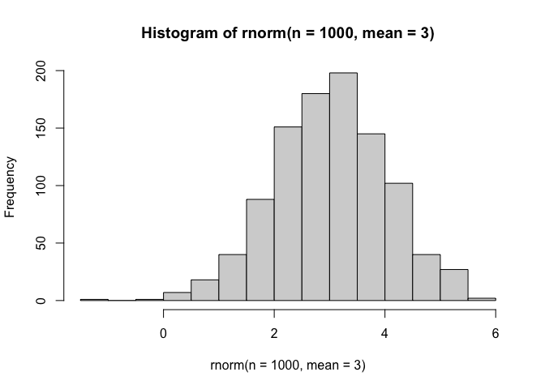
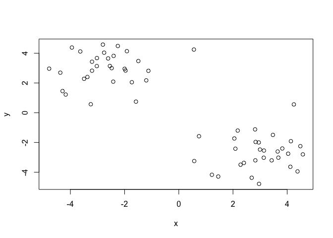
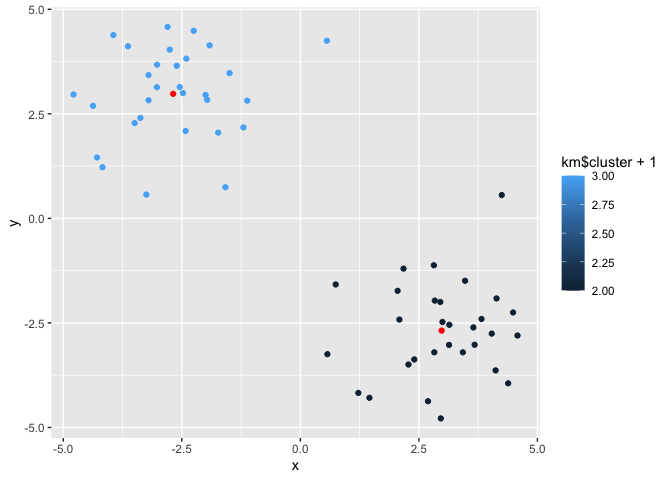
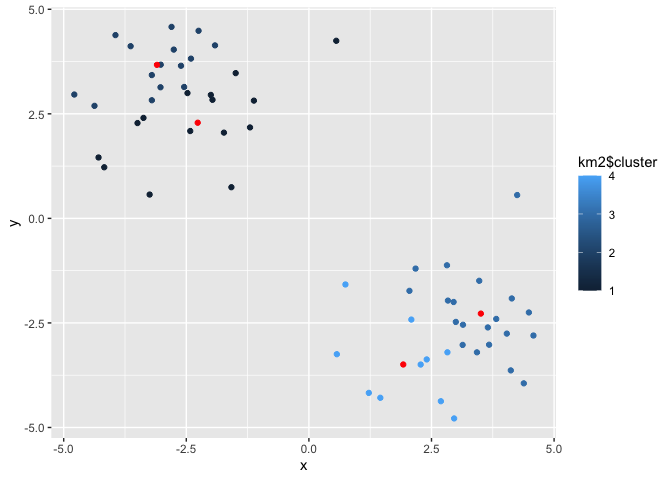
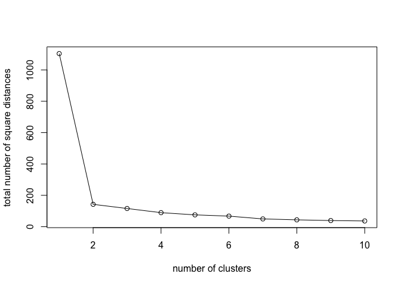
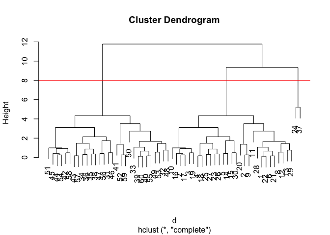
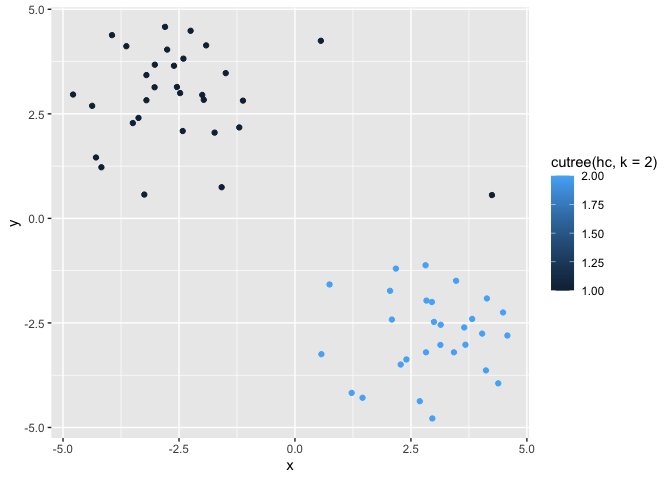
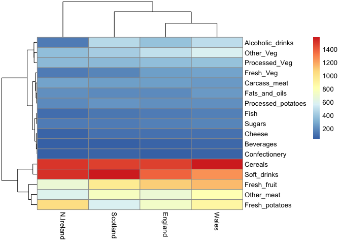
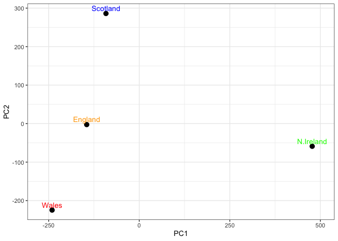

# Class 7: Machine Learning 1
Derek Zhang (PID: A17819201)

- [Exploring core machine learning
  methods:](#exploring-core-machine-learning-methods)
  - [K-means clustering](#k-means-clustering)
  - [Hierarchical Clustering](#hierarchical-clustering)
- [Principal Component Analysis - Analysis of UK Food
  Data](#principal-component-analysis---analysis-of-uk-food-data)
  - [Data Import:](#data-import)

# Exploring core machine learning methods:

This will include **clustering**, and **dimensional** **reduction**.

## K-means clustering

The main function in “base” R for K-means clustering is called
`kmeans()`. We will generate data with `rnorm()`.

``` r
hist(rnorm(n = 1000, mean = 3))
```



Now that we know how to use `rnorm()`, we can make the dataset.
`cbind()` is so insanely OP for its ability to combine data laterally,
by row.

``` r
x <- c(rnorm(30,-3), rnorm(30,3))
y <- rev(x)
z <- cbind(x = x, y = rev(x))
plot(z)
```



Now we can run `kmeans()` on z.

``` r
km <- kmeans(z, centers = 2)
```

> Q1. How many points are in each cluster?

> ``` r
> km$size
> ```
>
>     [1] 30 30

> Q2. What “component” of your result do object details cluster
> assignment/membership?

> ``` r
> km$cluster
> ```
>
>      [1] 2 2 2 2 2 2 2 2 2 2 2 2 2 2 2 2 2 2 2 2 2 2 2 2 2 2 2 2 2 2 1 1 1 1 1 1 1 1
>     [39] 1 1 1 1 1 1 1 1 1 1 1 1 1 1 1 1 1 1 1 1 1 1

> Q3. How do your kmeans center?

> ``` r
> km$center
> ```
>
>               x         y
>     1  2.979027 -2.682528
>     2 -2.682528  2.979027

> Q4. Plot ‘z’ colored by the kmeans cluster assignment and add cluster
> centers as blue points

> ``` r
> library(ggplot2)
> ggplot(z, aes(x = x, y = y)) +
>   geom_point(aes(color = km$cluster+1)) +
>   geom_point(data = km$center, color = "red") # Setting a separate set
> ```
>
> 
>
> ``` r
>   # of points that are the centers of each cluster
> ```

> Q5. Run a K-means clustering and plot the results asking for 4
> clusters

> ``` r
> km2 = kmeans(z, centers = 4) #just set centers to 4 for 4 clusteres
> library(ggplot2)
> ggplot(z, aes(x = x, y = y)) +
>   geom_point(aes(color = km2$cluster)) +
>   geom_point(data = km2$center, color = "red")
> ```
>
> 

Now we can optimize to determine which is the best number of clusters:

``` r
ans <- c()
for (i in 1:10) { #looping the code below runs it iteratively and collects
  # accuracy data from "withinss"
  km <- kmeans(z, centers = i)
  ans <- c(ans, km$tot.withinss)
}

plot(ans, type='o', xlab = "number of clusters", ylab="total number of square distances") # plots the outcomes of accuracies
```



## Hierarchical Clustering

The main function in “base” R for hierarchical clustering is called
`hclust()`. This function does not take raw data, you must first build a
similarity/distance matrix from the data.

``` r
d <- dist(z)
hc <- hclust(d)
hc
```


    Call:
    hclust(d = d)

    Cluster method   : complete 
    Distance         : euclidean 
    Number of objects: 60 

There is a bespoke `plot()` method for `hclust()` result objects.

``` r
plot(hc)
abline(h=8, col="red")
```



Once we have our `hclust` object (our “tree” of cluster dendrogram) we
can *cut* the tree to reveal the clustering pattern.

``` r
cutree(hc, h=8)
```

     [1] 1 1 1 1 1 1 1 1 1 1 1 1 1 1 1 1 1 1 1 1 1 1 1 2 1 1 1 1 1 1 3 3 3 3 3 3 2 3
    [39] 3 3 3 3 3 3 3 3 3 3 3 3 3 3 3 3 3 3 3 3 3 3

> Q6. Make a plot of `z` with your `hclust` results (i.e. colored by
> cluster membership)

> ``` r
> library(ggplot2)
> ggplot(z, aes(x = x, y = y, color = cutree(hc, k=2))) +
>   geom_point()
> ```
>
> 

# Principal Component Analysis - Analysis of UK Food Data

## Data Import:

Importing the data below:

``` r
url <- "https://tinyurl.com/UK-foods"
x <- read.csv(url)
```

> Q1. How many rows and columns are in your new data frame named x? What
> R functions could you use to answer this question?

We can use the dim(df) function. This function returns the dimensions of
the data frame in rows x cols.

``` r
## Complete the following code to find out how many rows and columns are in x?
dim(x)
```

    [1] 17  5

Checking the first 6 rows is done with `head()`

``` r
head(x)
```

                   X England Wales Scotland N.Ireland
    1         Cheese     105   103      103        66
    2  Carcass_meat      245   227      242       267
    3    Other_meat      685   803      750       586
    4           Fish     147   160      122        93
    5 Fats_and_oils      193   235      184       209
    6         Sugars     156   175      147       139

Correcting the row-names problem presented by the row indexes being
present as the first row

``` r
# Note how the minus indexing works
x <- read.csv(url, row.names=1)
head(x)
```

                   England Wales Scotland N.Ireland
    Cheese             105   103      103        66
    Carcass_meat       245   227      242       267
    Other_meat         685   803      750       586
    Fish               147   160      122        93
    Fats_and_oils      193   235      184       209
    Sugars             156   175      147       139

``` r
dim(x)
```

    [1] 17  4

> Q2. The second method of `read.csv(url, row.names=1)` is more robust,
> as it is a direct read from the source and makes an un-redundant
> adjustment. When running the other version `x[,-1]`, if ran more than
> once, there is a risk of deleting more information than desired.
>
> Q3. Changing the boolean parameter `beside` to `F` or False will
> change the bar graph into the desired form.

> ``` r
> barplot(as.matrix(x), beside=F, col=rainbow(nrow(x))) # the only change 
> ```
>
> 
>
> ``` r
> # made is beside = F
> ```

This converts the data to a ‘long’ format:

``` r
library(tidyr)

# Convert data to long format for ggplot with `pivot_longer()`
x_long <- x |> 
          tibble::rownames_to_column("Food") |> 
          pivot_longer(cols = -Food, 
                       names_to = "Country", 
                       values_to = "Consumption")

dim(x_long)
```

    [1] 68  3

``` r
library(ggplot2)
ggplot(x_long) +
  aes(x = Country, y = Consumption, fill = Food) +
  geom_col(position = "dodge") +
  theme_bw()
```


> Q4. To get the stacked barplot, we would need to delete the position =
> “dodge” option as that causes each bar to be placed side by side. Just
> getting rid of it allows the stacked bar graph.

> ``` r
> library(ggplot2)
> ggplot(x_long) +
>   aes(x = Country, y = Consumption, fill = Food) +
>   geom_col() +
>   theme_bw()
> ```
>
> 

> Q5. `pairs()` creates a scatterplot matrice which allows us to
> visualize the relationship between multiple variables at the same
> time. If a point in one of the scatterplots lies on the diagonal for
> that plot then we know that those variables are pretty well
> correlated.

> ``` r
> pairs(x, col=rainbow(nrow(x)), pch=16)
> ```
>
> 

Heatmapping the data:

``` r
library(pheatmap)

pheatmap( as.matrix(x) )
```



> Q6. The top dendrogram shows that Scotland, England, and Wales cluster
> closely together while North Ireland remains an outlier. This suggests
> that North Ireland has distinctly different food consumption patterns
> as opposed to Scotland, England, and Wales. This is further reinforced
> by the greater spread of points from the diagonal for any graphs that
> included North Ireland in the pairs figure. The fact that each plot
> that compared N.Ireland to others had greater deviance from the
> diagonal than any other combination of comparisons shows that there is
> less correlation in consumption patterns of food between N. Ireland
> compared to the rest of the UK countries in question.

PCA analysis is conducted below, extracting information from
high-dimension data and understanding relationships from information
with high levels of complexity:

``` r
pca <- prcomp( t(x) )
summary(pca)
```

    Importance of components:
                                PC1      PC2      PC3       PC4
    Standard deviation     324.1502 212.7478 73.87622 2.921e-14
    Proportion of Variance   0.6744   0.2905  0.03503 0.000e+00
    Cumulative Proportion    0.6744   0.9650  1.00000 1.000e+00

> Q7. Complete the code below:
>
> Q8. Customize the plot so that country names match the colors in the
> UK and Ireland map and table at the start of this document.

> ``` r
> # Create a data frame for plotting
> df <- as.data.frame(pca$x)
> df$Country <- rownames(df)
>
> # Plot PC1 vs PC2 with ggplot
> ggplot(pca$x) +
>   aes(x = PC1, y = PC2, label = rownames(pca$x)) +
>   geom_point(size = 3) +
>   geom_text(vjust = -0.5, color = c("orange","red", "blue", "green")) +
>   xlim(-270, 500) +
>   xlab("PC1") +
>   ylab("PC2") +
>   theme_bw()
> ```
>
> 

``` r
v <- round( pca$sdev^2/sum(pca$sdev^2) * 100 )
v
```

    [1] 67 29  4  0

``` r
z <- summary(pca)
z$importance
```

                                 PC1       PC2      PC3          PC4
    Standard deviation     324.15019 212.74780 73.87622 2.921348e-14
    Proportion of Variance   0.67444   0.29052  0.03503 0.000000e+00
    Cumulative Proportion    0.67444   0.96497  1.00000 1.000000e+00

``` r
# Create scree plot with ggplot
variance_df <- data.frame(
  PC = factor(paste0("PC", 1:length(v)), levels = paste0("PC", 1:length(v))),
  Variance = v
)

ggplot(variance_df) +
  aes(x = PC, y = Variance) +
  geom_col(fill = "steelblue") +
  xlab("Principal Component") +
  ylab("Percent Variation") +
  theme_bw() +
  theme(axis.text.x = element_text(angle = 0))
```


``` r
## Lets focus on PC1 as it accounts for > 90% of variance 
ggplot(pca$rotation) +
  aes(x = PC1, 
      y = reorder(rownames(pca$rotation), PC1)) +
  geom_col(fill = "steelblue") +
  xlab("PC1 Loading Score") +
  ylab("") +
  theme_bw() +
  theme(axis.text.y = element_text(size = 9))
```


> Q9. The main 2 food groups being featured are soft drinks and fresh
> potatoes. Countries that score high on PC2 probably consume a lot of
> soft drinks and countries that score low on PC2 consume a lot of
> potatoes. PC2 tells us about a tradeoff between consumption of
> soft-drinks or processed foods as opposed to fresh vegetable stables,
> such as potatos, other_veg, as opposed to soft_drinks, alcoholic
> drinks, processed_potatoes.

> ``` r
> ggplot(pca$rotation) +
>   aes(x = PC2, #adjusted all pc1 for pc2, changed labels
>       y = reorder(rownames(pca$rotation), PC2)) +
>   geom_col(fill = "steelblue") +
>   xlab("PC2 Loading Score") +
>   ylab("") +
>   theme_bw() +
>   theme(axis.text.y = element_text(size = 9))
> ```
>
> 

The PCA score plot and the loading plots are complimentary to one
another. The loading plots help visualize parameter effects on the
principle components, while the PCA score plot helps visualize the
principle components in relation to one another.
