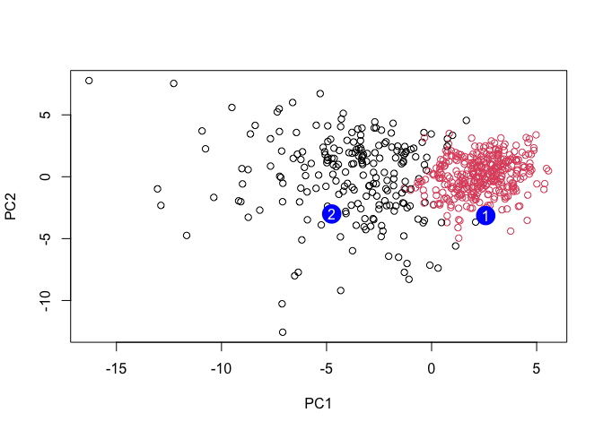

# Class 08: Breast Cancer Mini Project
Derek Zhang - PID A17819201

- [Background](#background)
- [Data Import](#data-import)
- [Principal Component Analysis
  Preparation](#principal-component-analysis-preparation)
- [Interpreting PCA results](#interpreting-pca-results)
- [Variance Explained](#variance-explained)
- [Communicating PCA Results](#communicating-pca-results)
- [Hierarchical Clustering](#hierarchical-clustering)
- [Visualizing Hierarchical Cluster
  Results](#visualizing-hierarchical-cluster-results)
- [Selecting number of clusters](#selecting-number-of-clusters)
- [Combining Methods](#combining-methods)
- [Sensitivity/Specificity](#sensitivityspecificity)
- [Prediction](#prediction)

## Background

The goal of today’s work is to explore a complete analysis using the
unsupervised learning techniques covered in class. Analysing a data-set
describing the characteristics of cell nuclei from fine needle
aspiration of breast mass will reveal critical information on its state
of tumor progression.

## Data Import

First we will import our data from Wisconsin Cancer data as a dataframe

``` r
fna.data <- "WisconsinCancer.csv"
wisc.df <- read.csv(fna.data, row.names=1) #runs a csv read into df
```

Next we will visualize this data just to gain a preliminary
understanding

``` r
head(wisc.df)
```

             diagnosis radius_mean texture_mean perimeter_mean area_mean
    842302           M       17.99        10.38         122.80    1001.0
    842517           M       20.57        17.77         132.90    1326.0
    84300903         M       19.69        21.25         130.00    1203.0
    84348301         M       11.42        20.38          77.58     386.1
    84358402         M       20.29        14.34         135.10    1297.0
    843786           M       12.45        15.70          82.57     477.1
             smoothness_mean compactness_mean concavity_mean concave.points_mean
    842302           0.11840          0.27760         0.3001             0.14710
    842517           0.08474          0.07864         0.0869             0.07017
    84300903         0.10960          0.15990         0.1974             0.12790
    84348301         0.14250          0.28390         0.2414             0.10520
    84358402         0.10030          0.13280         0.1980             0.10430
    843786           0.12780          0.17000         0.1578             0.08089
             symmetry_mean fractal_dimension_mean radius_se texture_se perimeter_se
    842302          0.2419                0.07871    1.0950     0.9053        8.589
    842517          0.1812                0.05667    0.5435     0.7339        3.398
    84300903        0.2069                0.05999    0.7456     0.7869        4.585
    84348301        0.2597                0.09744    0.4956     1.1560        3.445
    84358402        0.1809                0.05883    0.7572     0.7813        5.438
    843786          0.2087                0.07613    0.3345     0.8902        2.217
             area_se smoothness_se compactness_se concavity_se concave.points_se
    842302    153.40      0.006399        0.04904      0.05373           0.01587
    842517     74.08      0.005225        0.01308      0.01860           0.01340
    84300903   94.03      0.006150        0.04006      0.03832           0.02058
    84348301   27.23      0.009110        0.07458      0.05661           0.01867
    84358402   94.44      0.011490        0.02461      0.05688           0.01885
    843786     27.19      0.007510        0.03345      0.03672           0.01137
             symmetry_se fractal_dimension_se radius_worst texture_worst
    842302       0.03003             0.006193        25.38         17.33
    842517       0.01389             0.003532        24.99         23.41
    84300903     0.02250             0.004571        23.57         25.53
    84348301     0.05963             0.009208        14.91         26.50
    84358402     0.01756             0.005115        22.54         16.67
    843786       0.02165             0.005082        15.47         23.75
             perimeter_worst area_worst smoothness_worst compactness_worst
    842302            184.60     2019.0           0.1622            0.6656
    842517            158.80     1956.0           0.1238            0.1866
    84300903          152.50     1709.0           0.1444            0.4245
    84348301           98.87      567.7           0.2098            0.8663
    84358402          152.20     1575.0           0.1374            0.2050
    843786            103.40      741.6           0.1791            0.5249
             concavity_worst concave.points_worst symmetry_worst
    842302            0.7119               0.2654         0.4601
    842517            0.2416               0.1860         0.2750
    84300903          0.4504               0.2430         0.3613
    84348301          0.6869               0.2575         0.6638
    84358402          0.4000               0.1625         0.2364
    843786            0.5355               0.1741         0.3985
             fractal_dimension_worst
    842302                   0.11890
    842517                   0.08902
    84300903                 0.08758
    84348301                 0.17300
    84358402                 0.07678
    843786                   0.12440

To ensure we don’t keep the “answer” to our analysis in the database, we
must remove the diagnosis column, and we can store it elsewhere.

``` r
diagnosis <- wisc.df[,1]
wisc.data <- wisc.df[,-1]
```

> Q1. There are 569 observations.

> ``` r
> dim(wisc.data)
> ```
>
>     [1] 569  30

> Q2. 212 observations had the Malignant diagnosis

> ``` r
> sum(diagnosis == "M") # converts diagnosis into a true or false where true is 
> ```
>
>     [1] 212
>
> ``` r
> #malignant and utilizes those values to find how many diagnosis are malignant
> ```

> Q3. 10 variables/features are suffixed with “\_mean”

> ``` r
> length(grep("_mean", colnames(wisc.data), value = T) ) # uses a regex pattern
> ```
>
>     [1] 10
>
> ``` r
> # matching method called grep to determine how many col titles have _mean
> ```

## Principal Component Analysis Preparation

First we must check if the data needs to be scaled at all

``` r
# Check column means and standard deviations
colMeans(wisc.data)
```

                radius_mean            texture_mean          perimeter_mean 
               1.412729e+01            1.928965e+01            9.196903e+01 
                  area_mean         smoothness_mean        compactness_mean 
               6.548891e+02            9.636028e-02            1.043410e-01 
             concavity_mean     concave.points_mean           symmetry_mean 
               8.879932e-02            4.891915e-02            1.811619e-01 
     fractal_dimension_mean               radius_se              texture_se 
               6.279761e-02            4.051721e-01            1.216853e+00 
               perimeter_se                 area_se           smoothness_se 
               2.866059e+00            4.033708e+01            7.040979e-03 
             compactness_se            concavity_se       concave.points_se 
               2.547814e-02            3.189372e-02            1.179614e-02 
                symmetry_se    fractal_dimension_se            radius_worst 
               2.054230e-02            3.794904e-03            1.626919e+01 
              texture_worst         perimeter_worst              area_worst 
               2.567722e+01            1.072612e+02            8.805831e+02 
           smoothness_worst       compactness_worst         concavity_worst 
               1.323686e-01            2.542650e-01            2.721885e-01 
       concave.points_worst          symmetry_worst fractal_dimension_worst 
               1.146062e-01            2.900756e-01            8.394582e-02 

``` r
apply(wisc.data,2,sd)
```

                radius_mean            texture_mean          perimeter_mean 
               3.524049e+00            4.301036e+00            2.429898e+01 
                  area_mean         smoothness_mean        compactness_mean 
               3.519141e+02            1.406413e-02            5.281276e-02 
             concavity_mean     concave.points_mean           symmetry_mean 
               7.971981e-02            3.880284e-02            2.741428e-02 
     fractal_dimension_mean               radius_se              texture_se 
               7.060363e-03            2.773127e-01            5.516484e-01 
               perimeter_se                 area_se           smoothness_se 
               2.021855e+00            4.549101e+01            3.002518e-03 
             compactness_se            concavity_se       concave.points_se 
               1.790818e-02            3.018606e-02            6.170285e-03 
                symmetry_se    fractal_dimension_se            radius_worst 
               8.266372e-03            2.646071e-03            4.833242e+00 
              texture_worst         perimeter_worst              area_worst 
               6.146258e+00            3.360254e+01            5.693570e+02 
           smoothness_worst       compactness_worst         concavity_worst 
               2.283243e-02            1.573365e-01            2.086243e-01 
       concave.points_worst          symmetry_worst fractal_dimension_worst 
               6.573234e-02            6.186747e-02            1.806127e-02 

Next, the PCA is executed by running `prcomp()`

``` r
wisc.pr <- prcomp(wisc.data, scale = TRUE)
summary(wisc.pr)
```

    Importance of components:
                              PC1    PC2     PC3     PC4     PC5     PC6     PC7
    Standard deviation     3.6444 2.3857 1.67867 1.40735 1.28403 1.09880 0.82172
    Proportion of Variance 0.4427 0.1897 0.09393 0.06602 0.05496 0.04025 0.02251
    Cumulative Proportion  0.4427 0.6324 0.72636 0.79239 0.84734 0.88759 0.91010
                               PC8    PC9    PC10   PC11    PC12    PC13    PC14
    Standard deviation     0.69037 0.6457 0.59219 0.5421 0.51104 0.49128 0.39624
    Proportion of Variance 0.01589 0.0139 0.01169 0.0098 0.00871 0.00805 0.00523
    Cumulative Proportion  0.92598 0.9399 0.95157 0.9614 0.97007 0.97812 0.98335
                              PC15    PC16    PC17    PC18    PC19    PC20   PC21
    Standard deviation     0.30681 0.28260 0.24372 0.22939 0.22244 0.17652 0.1731
    Proportion of Variance 0.00314 0.00266 0.00198 0.00175 0.00165 0.00104 0.0010
    Cumulative Proportion  0.98649 0.98915 0.99113 0.99288 0.99453 0.99557 0.9966
                              PC22    PC23   PC24    PC25    PC26    PC27    PC28
    Standard deviation     0.16565 0.15602 0.1344 0.12442 0.09043 0.08307 0.03987
    Proportion of Variance 0.00091 0.00081 0.0006 0.00052 0.00027 0.00023 0.00005
    Cumulative Proportion  0.99749 0.99830 0.9989 0.99942 0.99969 0.99992 0.99997
                              PC29    PC30
    Standard deviation     0.02736 0.01153
    Proportion of Variance 0.00002 0.00000
    Cumulative Proportion  1.00000 1.00000

> Q4. 0.4427 Proportion of variance is captured by the first principal
> component.
>
> Q5. 3 Principal components, as principal component 3 is when the
> cumulative proportion sums to over 0.70.
>
> Q6. 7 Principal components, as principal component 7 is when the
> cumulative proportion sums to over 0.90.

## Interpreting PCA results

> Q7. There is a lot going on in this graph, seems to have a lot of data
> that is all overlapping, heavily connecting to one another. Not useful
> for data.

``` r
biplot(wisc.pr)
```


This is a hard to read and not very useful graph, instead:

``` r
# Scatter plot observations by components 1 and 2
library(ggplot2)

ggplot(wisc.pr$x) +
  aes(x = PC1, y = PC2, col=diagnosis) + #coloring based on diagnosis result
  geom_point()
```


> Q8. A similar graph for PC1 and PC3 shows that benign and malignant
> observations have distinct separation in component values, which
> suggests that principal components can be used to diagnose malignancy
> in samples.

> ``` r
> # Repeat for components 1 and 3
> ggplot(wisc.pr$x) +
>   aes(PC1, PC3, col=diagnosis) +
>   geom_point()
> ```
>
> 

## Variance Explained

We have to calculate the variance of each PC

``` r
pr.var <- wisc.pr$sdev^2 
head(pr.var)
```

    [1] 13.281608  5.691355  2.817949  1.980640  1.648731  1.207357

Now we will calculate the variance explained by each PC by dividing
total variance explained of all principal components.

``` r
# Variance explained by each principal component: pve
pve <- pr.var / sum(pr.var) #simple division to get ratios of prVar to total var

# Plot variance explained for each principal component
plot(c(1,pve), xlab = "Principal Component", 
     ylab = "Proportion of Variance Explained", 
     ylim = c(0, 1), type = "o")
```


``` r
# Alternative scree plot of the same data, note data driven y-axis
barplot(pve, ylab = "Percent of Variance Explained",
     names.arg=paste0("PC",1:length(pve)), las=2, axes = FALSE) 
axis(2, at=pve, labels=round(pve,2)*100 )
```


## Communicating PCA Results

> Q9.`concave.points_mean` for principal component 1 is -0.2609. This
> feature has the highest absolute value, which means that it is the
> greatest contributing feature to the first principal component.

> ``` r
> wisc.pr$rotation[,1] #allows visualization of loading values for PC1
> ```
>
>                 radius_mean            texture_mean          perimeter_mean 
>                 -0.21890244             -0.10372458             -0.22753729 
>                   area_mean         smoothness_mean        compactness_mean 
>                 -0.22099499             -0.14258969             -0.23928535 
>              concavity_mean     concave.points_mean           symmetry_mean 
>                 -0.25840048             -0.26085376             -0.13816696 
>      fractal_dimension_mean               radius_se              texture_se 
>                 -0.06436335             -0.20597878             -0.01742803 
>                perimeter_se                 area_se           smoothness_se 
>                 -0.21132592             -0.20286964             -0.01453145 
>              compactness_se            concavity_se       concave.points_se 
>                 -0.17039345             -0.15358979             -0.18341740 
>                 symmetry_se    fractal_dimension_se            radius_worst 
>                 -0.04249842             -0.10256832             -0.22799663 
>               texture_worst         perimeter_worst              area_worst 
>                 -0.10446933             -0.23663968             -0.22487053 
>            smoothness_worst       compactness_worst         concavity_worst 
>                 -0.12795256             -0.21009588             -0.22876753 
>        concave.points_worst          symmetry_worst fractal_dimension_worst 
>                 -0.25088597             -0.12290456             -0.13178394 

## Hierarchical Clustering

Scaling the data first for clustering

``` r
data.scaled <- scale(wisc.data)
```

Then calculate euclidean distance between all pairs of observations in
the new scaled dataset

``` r
data.dist <- dist(data.scaled) #creates the distance of data
```

Then create the hierarchical clustering model

``` r
wisc.hclust <- hclust(data.dist, method="complete") # generates an hclust using 
#the method complete
```

## Visualizing Hierarchical Cluster Results

``` r
plot(wisc.hclust) #visualises the hclust
abline(h=19, col="red", lty=2) # adds a line to the previous plot at height 19
```


> Q10. The height at which the clustering model has 4 clusters is 19,
> but that isn’t the exact height it starts at, as that would be a
> non-integer. I do know that at height 19 there are exactly 4 clusters,
> though.

## Selecting number of clusters

Creating a hierarchical cluster with 4 clusters

``` r
wisc.hclust.clusters <- cutree(wisc.hclust, k = 4) #cutree cuts the prior tree
# into the desirable number of clusters
table(wisc.hclust.clusters, diagnosis) #visualizes the result of cutting based on 
```

                        diagnosis
    wisc.hclust.clusters   B   M
                       1  12 165
                       2   2   5
                       3 343  40
                       4   0   2

``` r
# diagnoses outcomes, demonstrates cluster correlation to diagnosis
```

> Q12. `ward.D2` is preferred because it minimizes within-cluster
> variance, producing more compact and evenly sized clusters compared to
> the other methods. Single linkage tends to produce chaining effects,
> while complete and average linkage produce less balanced clusters.

## Combining Methods

``` r
## Use the distance along the first 7 PCs for clustering i.e. wisc.pr$x[, 1:7]
wisc.pr.hclust <- hclust(dist(wisc.pr$x[,1:7]), method="ward.D2") #dist is important
#to get the distances of the first 7 PCs, using method "ward.D2"
wisc.pr.hclust.clusters <- cutree(wisc.pr.hclust, k=2) #cut at 2 clusters
grps <- cutree(wisc.pr.hclust, k=2) # creates groups for later
```

> Q13. The hclust model separates M and B diagnoses reasonably well.
> Cluster 1 is predominantly malignant (188 M, 28 B) and cluster 2 is
> predominantly benign (329 B, 24 M). This method is not perfect as 52
> samples were misclassified.

> ``` r
> table(wisc.pr.hclust.clusters, diagnosis) # outputs a table for comparison
> ```
>
>                            diagnosis
>     wisc.pr.hclust.clusters   B   M
>                           1  28 188
>                           2 329  24

> Q14. The non-PCA hclust model performs slightly worse overall. It
> correctly identifies more benign cases (343 vs 329) but it misses more
> malignant cases, as it only captured 165 out of 212 M correctly
> compared to 188 with PCA. Since missing malignant diagnoses is more
> dangerous in a clinical setting, the PCA-based hclust model performs
> better in the most important category. As such, because they have
> approximately the same amount of errors, the PCA-based hclust model is
> the better performing method.

> ``` r
> table(wisc.hclust.clusters, diagnosis) # outputs a table for comparison
> ```
>
>                         diagnosis
>     wisc.hclust.clusters   B   M
>                        1  12 165
>                        2   2   5
>                        3 343  40
>                        4   0   2

## Sensitivity/Specificity

Optional question here, will leave blank for now.

## Prediction

``` r
url <- "https://tinyurl.com/new-samples-CSV"
new <- read.csv(url) # reads csv from url
npc <- predict(wisc.pr, newdata=new) #predicts from the previous data, and the new 
npc
```

               PC1       PC2        PC3        PC4       PC5        PC6        PC7
    [1,]  2.576616 -3.135913  1.3990492 -0.7631950  2.781648 -0.8150185 -0.3959098
    [2,] -4.754928 -3.009033 -0.1660946 -0.6052952 -1.140698 -1.2189945  0.8193031
                PC8       PC9       PC10      PC11      PC12      PC13     PC14
    [1,] -0.2307350 0.1029569 -0.9272861 0.3411457  0.375921 0.1610764 1.187882
    [2,] -0.3307423 0.5281896 -0.4855301 0.7173233 -1.185917 0.5893856 0.303029
              PC15       PC16        PC17        PC18        PC19       PC20
    [1,] 0.3216974 -0.1743616 -0.07875393 -0.11207028 -0.08802955 -0.2495216
    [2,] 0.1299153  0.1448061 -0.40509706  0.06565549  0.25591230 -0.4289500
               PC21       PC22       PC23       PC24        PC25         PC26
    [1,]  0.1228233 0.09358453 0.08347651  0.1223396  0.02124121  0.078884581
    [2,] -0.1224776 0.01732146 0.06316631 -0.2338618 -0.20755948 -0.009833238
                 PC27        PC28         PC29         PC30
    [1,]  0.220199544 -0.02946023 -0.015620933  0.005269029
    [2,] -0.001134152  0.09638361  0.002795349 -0.019015820

Plots the outcomes from the prediction

``` r
plot(wisc.pr$x[,1:2], col=grps) # plots the information of PC 1 and 2
points(npc[,1], npc[,2], col="blue", pch=16, cex=3) # assigns points
text(npc[,1], npc[,2], c(1,2), col="white") # makes labels
```



> Q16. Patient 1 information should be prioritized given that are
> organized amongst the cluster of malignant cases, suggesting that they
> may be malignant and require a followup for more detailed examination
> and biopsy checking. Patient 2 data lies in the benign cluster so they
> take lower priority for a checkup compared to patient 1.
