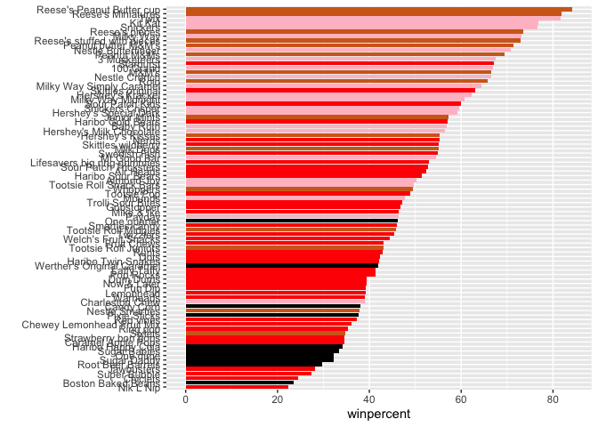
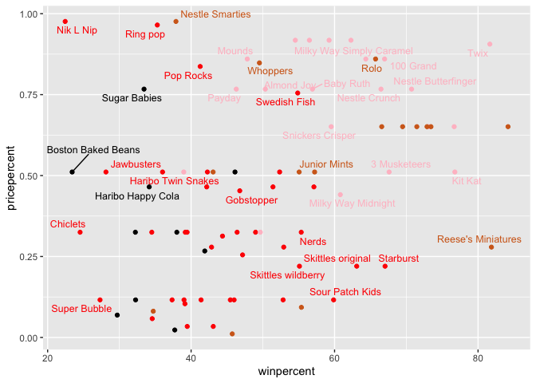
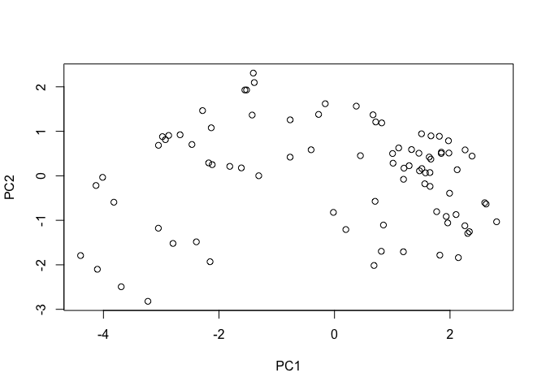
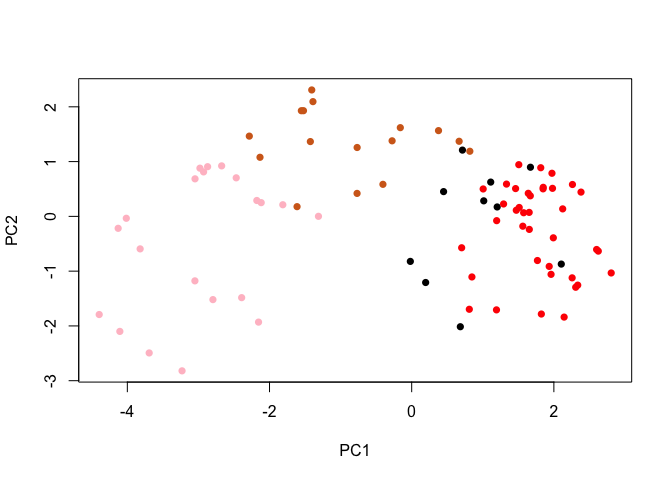
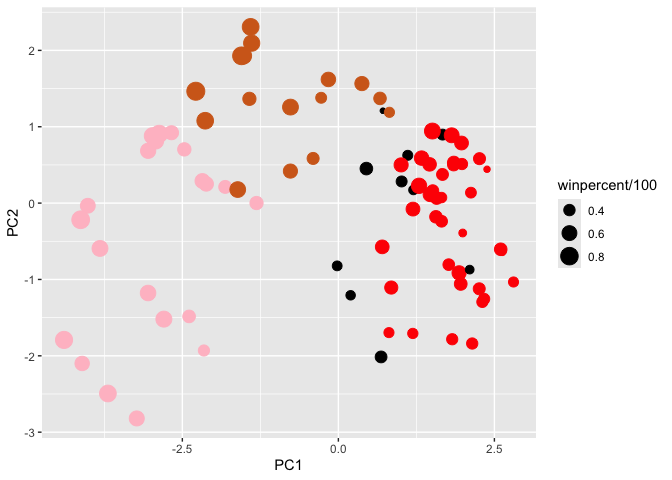
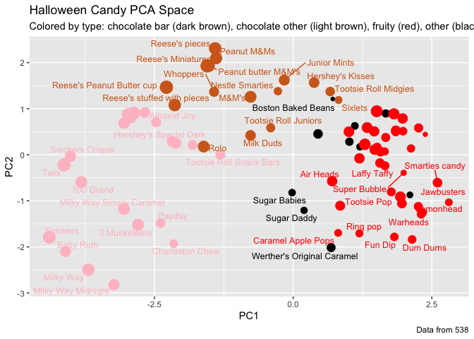

# Class 09: Candy Mini-Project
Derek Zhang - PID A17819201

- [Importing Candy Data](#importing-candy-data)
- [What is in this dataset?](#what-is-in-this-dataset)
- [What is your favorite candy?](#what-is-your-favorite-candy)
- [`skimr::skim()` function](#skimrskim-function)
- [Exploratory analysis](#exploratory-analysis)
- [Overall candy rankings](#overall-candy-rankings)
- [Adding some useful color](#adding-some-useful-color)
- [Taking a look at pricepercent](#taking-a-look-at-pricepercent)
- [Exploring the correlation
  structure](#exploring-the-correlation-structure)
- [Principal component analysis](#principal-component-analysis)
- [Summary](#summary)

## Importing Candy Data

Before we begin, we must first have the data loaded

``` r
candy_file <- "candy-data.csv"

candy = read.csv(candy_file, row.names=1)
head(candy)
```

                 chocolate fruity caramel peanutyalmondy nougat crispedricewafer
    100 Grand            1      0       1              0      0                1
    3 Musketeers         1      0       0              0      1                0
    One dime             0      0       0              0      0                0
    One quarter          0      0       0              0      0                0
    Air Heads            0      1       0              0      0                0
    Almond Joy           1      0       0              1      0                0
                 hard bar pluribus sugarpercent pricepercent winpercent
    100 Grand       0   1        0        0.732        0.860   66.97173
    3 Musketeers    0   1        0        0.604        0.511   67.60294
    One dime        0   0        0        0.011        0.116   32.26109
    One quarter     0   0        0        0.011        0.511   46.11650
    Air Heads       0   0        0        0.906        0.511   52.34146
    Almond Joy      0   1        0        0.465        0.767   50.34755

## What is in this dataset?

> Q1. There are 85 kinds of candy in this dataset

``` r
dim(candy) # checks dimensions of this dataset to check for rowcount
```

    [1] 85 12

> Q2. There are 38 fruity candy types in this dataset

``` r
sum(candy$fruity) # sums the values of the fruity column
```

    [1] 38

## What is your favorite candy?

``` r
library(dplyr) # installs dplyr
```


    Attaching package: 'dplyr'

    The following objects are masked from 'package:stats':

        filter, lag

    The following objects are masked from 'package:base':

        intersect, setdiff, setequal, union

``` r
candy %>%
  filter(row.names(candy)=="Twix") %>% # filter function filters for specific outcome 
  select(winpercent) # keeps the target value and reports it
```

         winpercent
    Twix   81.64291

> Q3. My favorite candy in this dataset is “Air Heads”, its winpercent
> value is 52.3%

> ``` r
> candy %>%
>   filter(row.names(candy)=="Air Heads") %>% # filter function filters for specific outcome 
>   select(winpercent) # keeps the target value and reports it
> ```
>
>               winpercent
>     Air Heads   52.34146

> Q4. The winpercent value of “Kit Kat” is 76.8%

> ``` r
> candy %>%
>   filter(row.names(candy)=="Kit Kat") %>% # filter function filters for specific outcome 
>   select(winpercent) # keeps the target value and reports it
> ```
>
>             winpercent
>     Kit Kat    76.7686

> Q5. The winpercent value of “Tootsie Roll Snack Bars” is 49.7%

> ``` r
> candy %>%
>   filter(row.names(candy)=="Tootsie Roll Snack Bars") %>% # filter function filters for specific outcome 
>   select(winpercent) # keeps the target value and reports it
> ```
>
>                             winpercent
>     Tootsie Roll Snack Bars    49.6535

## `skimr::skim()` function

``` r
library("skimr")
skim(candy)
```

|                                                  |       |
|:-------------------------------------------------|:------|
| Name                                             | candy |
| Number of rows                                   | 85    |
| Number of columns                                | 12    |
| \_\_\_\_\_\_\_\_\_\_\_\_\_\_\_\_\_\_\_\_\_\_\_   |       |
| Column type frequency:                           |       |
| numeric                                          | 12    |
| \_\_\_\_\_\_\_\_\_\_\_\_\_\_\_\_\_\_\_\_\_\_\_\_ |       |
| Group variables                                  | None  |

Data summary

**Variable type: numeric**

| skim_variable | n_missing | complete_rate | mean | sd | p0 | p25 | p50 | p75 | p100 | hist |
|:---|---:|---:|---:|---:|---:|---:|---:|---:|---:|:---|
| chocolate | 0 | 1 | 0.44 | 0.50 | 0.00 | 0.00 | 0.00 | 1.00 | 1.00 | ▇▁▁▁▆ |
| fruity | 0 | 1 | 0.45 | 0.50 | 0.00 | 0.00 | 0.00 | 1.00 | 1.00 | ▇▁▁▁▆ |
| caramel | 0 | 1 | 0.16 | 0.37 | 0.00 | 0.00 | 0.00 | 0.00 | 1.00 | ▇▁▁▁▂ |
| peanutyalmondy | 0 | 1 | 0.16 | 0.37 | 0.00 | 0.00 | 0.00 | 0.00 | 1.00 | ▇▁▁▁▂ |
| nougat | 0 | 1 | 0.08 | 0.28 | 0.00 | 0.00 | 0.00 | 0.00 | 1.00 | ▇▁▁▁▁ |
| crispedricewafer | 0 | 1 | 0.08 | 0.28 | 0.00 | 0.00 | 0.00 | 0.00 | 1.00 | ▇▁▁▁▁ |
| hard | 0 | 1 | 0.18 | 0.38 | 0.00 | 0.00 | 0.00 | 0.00 | 1.00 | ▇▁▁▁▂ |
| bar | 0 | 1 | 0.25 | 0.43 | 0.00 | 0.00 | 0.00 | 0.00 | 1.00 | ▇▁▁▁▂ |
| pluribus | 0 | 1 | 0.52 | 0.50 | 0.00 | 0.00 | 1.00 | 1.00 | 1.00 | ▇▁▁▁▇ |
| sugarpercent | 0 | 1 | 0.48 | 0.28 | 0.01 | 0.22 | 0.47 | 0.73 | 0.99 | ▇▇▇▇▆ |
| pricepercent | 0 | 1 | 0.47 | 0.29 | 0.01 | 0.26 | 0.47 | 0.65 | 0.98 | ▇▇▇▇▆ |
| winpercent | 0 | 1 | 50.32 | 14.71 | 22.45 | 39.14 | 47.83 | 59.86 | 84.18 | ▃▇▆▅▂ |

> Q6. Winpercent is on a distinctly different scale from the other
> values, which all have means under 1, but winpercent values have a
> mean of 50.32. But up until pluribus, most of the categories
> (chocolate, fruity, caramel, peanutyalmondy, nougat, crispedricewafer,
> hard, bar, pluribus) are all binary values while the others are
> non-binary. There are two types of scale in question here.
>
> Q7. A 0 represents that the candy is not chocolate, under the
> candy\$chocolate column, and a 1 under that column means that the
> candy in question is a chocolate.

## Exploratory analysis

> Q8.
>
> ggplot2 method:

> ``` r
> library("ggplot2")
> ggplot(candy, aes(x = winpercent)) + # loads a ggplot
>   geom_histogram() #builds a histogram
> ```
>
>     `stat_bin()` using `bins = 30`. Pick better value `binwidth`.
>
> 

> base R version

> ``` r
> hist(candy$winpercent) #builds a histogram of the data loaded
> ```
>
> 

> Q9. The distribution of winpercent is not clearly symmetrical, and
> seems to be skewed with a tail towards the right side.
>
> Q10. The center of the distribution seems to be just above 50%, if
> considering mean, but if considering median then the center seems to
> be below 50%. Median is our primary consideration here, however. So
> the center is below 50%.

> ``` r
> median(candy$winpercent) # returns median
> ```
>
>     [1] 47.82975
>
> ``` r
> mean(candy$winpercent) # returns mean
> ```
>
>     [1] 50.31676

> Q11. The winpercent of chocolate candies is greater than the
> winpercent of fruity candies.

> ``` r
> choc_wp <- candy %>% filter(chocolate == 1) %>% pull(winpercent)
> #pull method extracts a column as a vector so you don't force a dataframe into mean()
> fruity_wp <- candy %>% filter(fruity == 1) %>% pull(winpercent)
> mean(choc_wp)
> ```
>
>     [1] 60.92153
>
> ``` r
> mean(fruity_wp)
> ```
>
>     [1] 44.11974

> Q12. With a p-value of 2.871e-08, the null hypothesis is rejected and
> there is a statistically significant difference between chocolate
> candy and fruity candy winpercentages

> ``` r
> t_test_result <- t.test(choc_wp, fruity_wp) #runs a t-test using two vectors to test for statistical significance difference between two groups of data
> t_test_result
> ```
>
>
>       Welch Two Sample t-test
>
>     data:  choc_wp and fruity_wp
>     t = 6.2582, df = 68.882, p-value = 2.871e-08
>     alternative hypothesis: true difference in means is not equal to 0
>     95 percent confidence interval:
>      11.44563 22.15795
>     sample estimates:
>     mean of x mean of y 
>      60.92153  44.11974 

## Overall candy rankings

> Q13. The all time top 5 least favorite candies are Nik L Nip, Boston
> Baked Beans, Chiclets, Super Bubble, and Jawbusters with the 5 lowest
> winpercents

> ``` r
> head(candy[order(candy$winpercent),], n=5) #head only takes the top values, which
> ```
>
>                        chocolate fruity caramel peanutyalmondy nougat
>     Nik L Nip                  0      1       0              0      0
>     Boston Baked Beans         0      0       0              1      0
>     Chiclets                   0      1       0              0      0
>     Super Bubble               0      1       0              0      0
>     Jawbusters                 0      1       0              0      0
>                        crispedricewafer hard bar pluribus sugarpercent pricepercent
>     Nik L Nip                         0    0   0        1        0.197        0.976
>     Boston Baked Beans                0    0   0        1        0.313        0.511
>     Chiclets                          0    0   0        1        0.046        0.325
>     Super Bubble                      0    0   0        0        0.162        0.116
>     Jawbusters                        0    1   0        1        0.093        0.511
>                        winpercent
>     Nik L Nip            22.44534
>     Boston Baked Beans   23.41782
>     Chiclets             24.52499
>     Super Bubble         27.30386
>     Jawbusters           28.12744
>
> ``` r
> # are the lowest considering it is in ascending order
> ```

> Q14. The top 5 favorite candies by winpercent are Reese’s Peanut
> Butter Cup, Reese’s Miniatures, Twix, Kit Kats, and Snickers.

> ``` r
> tail(candy[order(candy$winpercent),], n=5) # tails returns the tail instead of
> ```
>
>                               chocolate fruity caramel peanutyalmondy nougat
>     Snickers                          1      0       1              1      1
>     Kit Kat                           1      0       0              0      0
>     Twix                              1      0       1              0      0
>     Reese's Miniatures                1      0       0              1      0
>     Reese's Peanut Butter cup         1      0       0              1      0
>                               crispedricewafer hard bar pluribus sugarpercent
>     Snickers                                 0    0   1        0        0.546
>     Kit Kat                                  1    0   1        0        0.313
>     Twix                                     1    0   1        0        0.546
>     Reese's Miniatures                       0    0   0        0        0.034
>     Reese's Peanut Butter cup                0    0   0        0        0.720
>                               pricepercent winpercent
>     Snickers                         0.651   76.67378
>     Kit Kat                          0.511   76.76860
>     Twix                             0.906   81.64291
>     Reese's Miniatures               0.279   81.86626
>     Reese's Peanut Butter cup        0.651   84.18029
>
> ``` r
> # the head, so it gives the biggest winpercent values
> ```

> Q15.

> ``` r
> ggplot(candy, aes(x = winpercent, y = rownames(candy))) +
>   geom_col()
> ```
>
> 

> Q16.

> ``` r
> ggplot(candy, aes(x = winpercent, y = reorder(rownames(candy), winpercent))) +
>   geom_col() 
> ```
>
> 
>
> ``` r
> # reorder placed here orders the bars by winpercent descending
> ```

## Adding some useful color

``` r
library(ggrepel)
my_cols=rep("black", nrow(candy))
my_cols[as.logical(candy$chocolate)] = "chocolate"
my_cols[as.logical(candy$bar)] = "pink"
my_cols[as.logical(candy$fruity)] = "red"
# as.logical() provides a vector of row indices that are true or 1

ggplot(candy) + 
  aes(winpercent, reorder(rownames(candy),winpercent)) +
  geom_col(fill=my_cols) +
  ylab("")# labels the y axis
```



> Q17. The worst ranked chocolate candy is Sixlets
>
> Q18. The best ranked fruity candy is Starburst

## Taking a look at pricepercent

``` r
library(ggrepel)

# How about a plot of win vs price
ggplot(candy) +
  aes(x=winpercent, y=pricepercent, label=rownames(candy)) +
  geom_point(col=my_cols) + 
  geom_text_repel(col=my_cols, size=3.3, max.overlaps = 5) # repel allows names to not
```



``` r
#overlap and occupy independent space for ease of viewing
```

> Q19. Based on a ratio of winpercent/pricepercent, you get the top 5
> highest winpercent per pricepercent candies: Tootsie Roll Midgies,
> Pixie Sticks, Fruit Chews, Dum Dums, and Strawberry bon bons

> ``` r
> candy_ratio <- candy %>% mutate(WP_PP = winpercent/pricepercent) #mutate creates
> # a new column that is a function of another column
> ord <- order(candy_ratio$WP_PP, decreasing = FALSE)
> tail(candy_ratio[ord,], n=5 )
> ```
>
>                          chocolate fruity caramel peanutyalmondy nougat
>     Strawberry bon bons          0      1       0              0      0
>     Dum Dums                     0      1       0              0      0
>     Fruit Chews                  0      1       0              0      0
>     Pixie Sticks                 0      0       0              0      0
>     Tootsie Roll Midgies         1      0       0              0      0
>                          crispedricewafer hard bar pluribus sugarpercent
>     Strawberry bon bons                 0    1   0        1        0.569
>     Dum Dums                            0    1   0        0        0.732
>     Fruit Chews                         0    0   0        1        0.127
>     Pixie Sticks                        0    0   0        1        0.093
>     Tootsie Roll Midgies                0    0   0        1        0.174
>                          pricepercent winpercent     WP_PP
>     Strawberry bon bons         0.058   34.57899  596.1895
>     Dum Dums                    0.034   39.46056 1160.6045
>     Fruit Chews                 0.034   43.08892 1267.3212
>     Pixie Sticks                0.023   37.72234 1640.1016
>     Tootsie Roll Midgies        0.011   45.73675 4157.8862

> Q20. The 5 most expensive candies are Nik L Nips, Nestle Smarties,
> Ring pops, Hershey’s Krackels, Hershey’s Milk Chocolate, with Nik L
> Nips at the lowest winpercent so the least favorite at 22.4%, so Nik L
> Nips are the least popular

> ``` r
> ord <- order(candy$pricepercent, decreasing = TRUE)
> head( candy[ord,c(11,12)], n=5 )
> ```
>
>                              pricepercent winpercent
>     Nik L Nip                       0.976   22.44534
>     Nestle Smarties                 0.976   37.88719
>     Ring pop                        0.965   35.29076
>     Hershey's Krackel               0.918   62.28448
>     Hershey's Milk Chocolate        0.918   56.49050

## Exploring the correlation structure

``` r
library(corrplot)
```

    corrplot 0.95 loaded

``` r
cij <- cor(candy)
corrplot(cij)
```


> Q22. Fruity and chocolate are the variables that are most strongly
> negatively correlated. But there are others that are slightly less
> negatively correlated, such as bar and pluribus.
>
> Q23. Fruity and Chocolate will have the largest contribution to the
> PC1 loadings because they are the variables that are most negatively
> correlated and will thus pull the data in opposite axis the strongest
> and drive the most separation.

## Principal component analysis

``` r
pca <- prcomp(candy, scale=TRUE) #prcomp generates a PCA analysis of a dataframe
summary(pca)
```

    Importance of components:
                              PC1    PC2    PC3     PC4    PC5     PC6     PC7
    Standard deviation     2.0788 1.1378 1.1092 1.07533 0.9518 0.81923 0.81530
    Proportion of Variance 0.3601 0.1079 0.1025 0.09636 0.0755 0.05593 0.05539
    Cumulative Proportion  0.3601 0.4680 0.5705 0.66688 0.7424 0.79830 0.85369
                               PC8     PC9    PC10    PC11    PC12
    Standard deviation     0.74530 0.67824 0.62349 0.43974 0.39760
    Proportion of Variance 0.04629 0.03833 0.03239 0.01611 0.01317
    Cumulative Proportion  0.89998 0.93832 0.97071 0.98683 1.00000

``` r
plot(pca$x[,1:2]) # plot plots the data
```



``` r
plot(pca$x[,1:2], col=my_cols, pch=16) 
```



``` r
# Make a new data-frame with our PCA results and candy data
my_data <- cbind(candy, pca$x[,1:3]) #cbind correlates dataframes by index
p <- ggplot(my_data) + 
        aes(x=PC1, y=PC2, 
            size=winpercent/100,  
            text=rownames(my_data),
            label=rownames(my_data)) +
        geom_point(col=my_cols)

p
```



``` r
p + geom_text_repel(size=3.3, col=my_cols, max.overlaps = 7)  + 
  theme(legend.position = "none") + #sets a theme for the plot
  labs(title="Halloween Candy PCA Space", #sets the title of the plot
       subtitle="Colored by type: chocolate bar (dark brown), chocolate other (light brown), fruity (red), other (black)", 
       caption="Data from 538")
```



``` r
# library(plotly)
# ggplotly(p)
```

> Q24. Fruity has the largest positive loading at approx 0.38, while
> pluribus comes close at approx 0.27 and hard at approx 0.22. This does
> make sense because these candies typically come in groups and bags of
> large quantities. which is a significant shared characteristic
> (pluribus), and many of these tend to be hard candies, such as
> skittles, jolly ranchers, so they are hard as well as fruity. This
> thus makes sense for why they load in PC1 together positively. This
> relationship was highlighted in the correlation plot prior, where
> pluribus correlated positively only with fruity candies, and fruity
> candies correlated positively with hard candies. hard and pluribus
> candies exclusively positively correlated with fruity candies.

``` r
ggplot(pca$rotation) +
  aes(x = PC1, y = reorder(rownames(pca$rotation), PC1)) +
  geom_col()
```


## Summary

> Q25. Based on the statistical analysis conducted here, a winning candy
> typically tends to be a chocolate candy of bar format, containing
> peanut/almondy flavors. This is supported by the top 5 candies in the
> winpercent category which were Reese’s Peanut Butter Cup (84.2%),
> Reese’s Miniatures (81.9%), Twix (81.6%), Kit Kat (76.8%), and
> Snickers (76.7%), all of which share these traits.
>
> The bar chart visualization clearly shows chocolate candies dominating
> the top winpercents, and the correlation analysis reveals that
> chocolate candies correlate negatively with fruity candies, meaning
> they are basically mutually exclusive. Thus, we were to design a
> candy, it would have to be either chocolate or candy or neither, and
> chocolate consistently scores high on winpercent so it would likely be
> a chocolate. The Bar format and peanut/almondy flavors are correlated
> strongly with chocolate candies so that would be a good decision to
> include.
>
> The PCA analysis confirms this structure of candy design. The PC1
> separates chocolate from fruity and the highest winpercent candies all
> cluster on the negative/chocolate side of the PC1. Thus you would
> likely choose to design a candy that contains the highest negative
> traits of PC1 for a successful candy given that chocolate is a key
> dominant winning feature.
