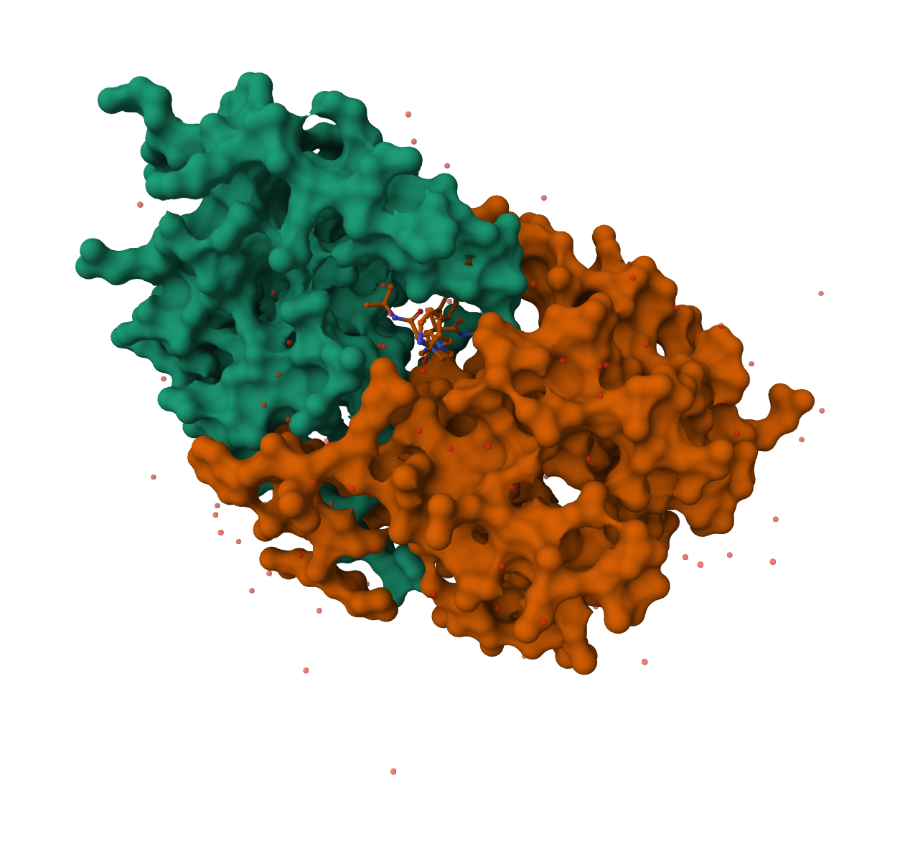
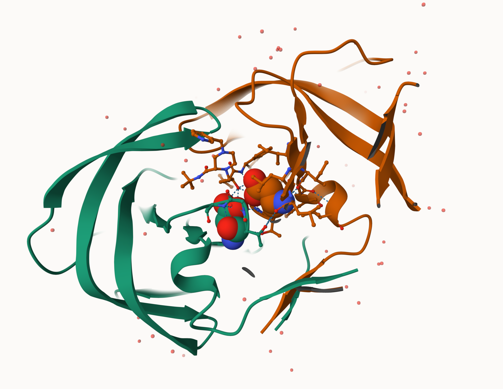
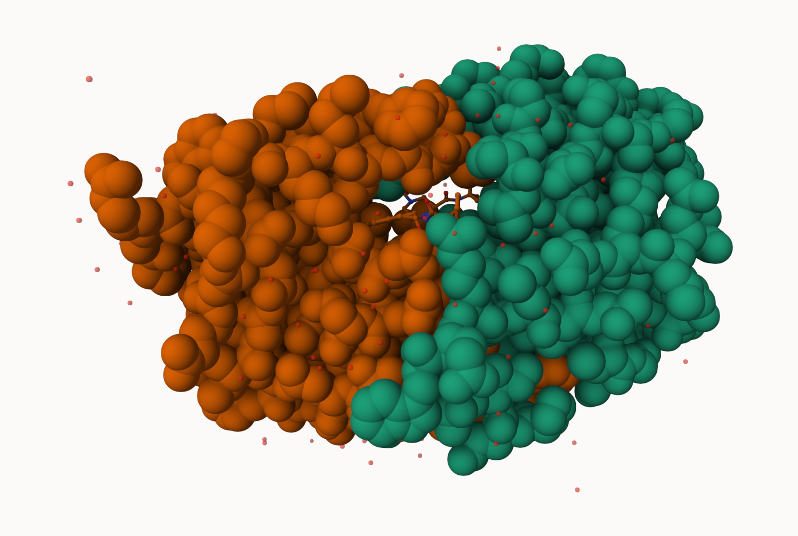
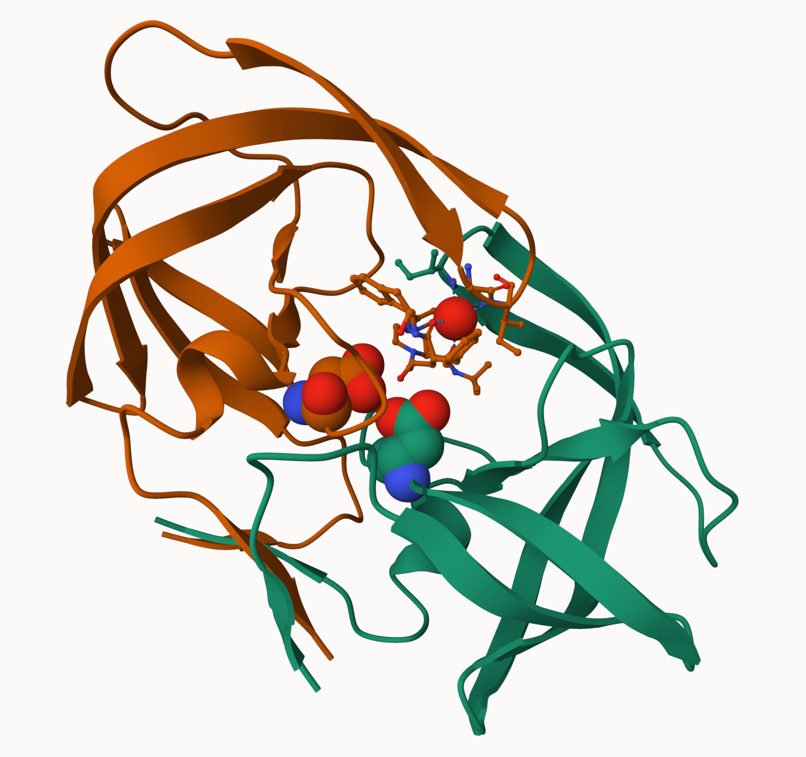

## First look at the data

> A key point is that we have a very, very small coverage of known proteins

```{r}
pdb <- read.csv("Data Export Summary.csv", row.names=1)
convert <- function(y){
  return (as.numeric(sub("," , "", x=pdb[[y]]))) #as.numeric() converts str to int
  
} # double bracket [[]] is used to hangle for columns given that it accepts variables
for (i in colnames(pdb)){
  pdb[[i]] = convert(i) #I made the convert function
}
#sum(pdb$X.ray)
pdb
```

> Q1. 93.9% of all structures in the pdb dataset were solved by X ray or EM
>
> ```{r}
> (sum(pdb$X.ray) + sum(pdb$EM))/sum(pdb$Total) # sum gives a vec total: arithmetic
> ```
>
> Q2. 98.0% of structures in the PDB are proteins
>
> ```{r}
> (pdb["Protein (only)","Total"]+pdb["Protein/Oligosaccharide","Total"]+pdb["Protein/NA","Total"])/sum(pdb$Total)
> ```
>
> Q3. There are 1227 HIV-1 protease structures in the PDB database

## Analysing with Molstar










> Q4. We only see one atom per water molecule because at this scale of view in terms of Angstrom, our resolution is too large to visualize the hydrogen atoms, which are extremely small
>
> Q5. This water molecule is number 308, and is visualised in the figure above
>
> Q6. This figure is made above

## Reading pdb data into R

```{r}
library(bio3d)
pdb <- read.pdb("1hsg")
pdb
```

> Q7. 198 amino acid residues
>
> Q8. HOH
>
> Q9. 2 Chains: A and B

```{r}
attributes(pdb)
```

## Pdb visualization in R

```{r}
library(bio3dview)
library(NGLVieweR)

#view.pdb(pdb) |> # allows viewing of a pdb file
  #setSpin()
```

```{r}
# Select the important ASP 25 residue
sele <- atom.select(pdb, resno=25)

# and highlight them in spacefill representation
#view.pdb(pdb, cols=c("navy","teal"), 
        # highlight = sele,
         #highlight.style = "spacefill") |>
  #setRock()
```

## Predicting functional motions of a single structure

```{r}
adk <- read.pdb("6s36")
adk
# Perform flexiblity prediction
m <- nma(adk)
plot(m)
```

```{r}
mktrj(m, file="adk_m7.pdb")
#view.nma(m, pdb=adk)
```

> Q10. msa is the only package above found only on bioconductor and not CRAN
>
> Q11. bio3dview is not found on either bioconductor or CRAN
>
> Q12. This is true

```{r}
library(bio3d)
aa <- get.seq("1ake_A")
#blast <- blast.pdb(aa)
aa
```

> Q13. This sequence is 214 amino acids long

```{r}
hits <- NULL
hits$pdb.id <- c('1AKE_A','6S36_A','6RZE_A','3HPR_A','1E4V_A','5EJE_A','1E4Y_A','3X2S_A','6HAP_A','6HAM_A','4K46_A','3GMT_A','4PZL_A')
files <- get.pdb(hits$pdb.id, path="pdbs", split=TRUE, gzip=TRUE)
# Align releated PDBs
pdbs <- pdbaln(files, fit = TRUE, exefile="msa")
```

```{r}
library(bio3dview)

#view.pdbs(pdbs)
```

```{r}
ids <- basename.pdb(pdbs$id)

anno <- pdb.annotate(ids)
unique(anno$source)
```

## PCA Analysis

```{r}
# Perform PCA
pc.xray <- pca(pdbs)
plot(pc.xray)
# Visualize first principal component
# Calculate RMSD
rd <- rmsd(pdbs)

# Structure-based clustering
hc.rd <- hclust(dist(rd))
grps.rd <- cutree(hc.rd, k=3)

plot(pc.xray, 1:2, col="grey50", bg=grps.rd, pch=21, cex=1)
pc1 <- mktrj(pc.xray, pc=1, file="pc_1.pdb")
```

```{r}
#Plotting results with ggplot2
library(ggplot2)
library(ggrepel)

df <- data.frame(PC1=pc.xray$z[,1], 
                 PC2=pc.xray$z[,2], 
                 col=as.factor(grps.rd),
                 ids=ids)

p <- ggplot(df) + 
  aes(PC1, PC2, col=col, label=ids) +
  geom_point(size=2) +
  geom_text_repel(max.overlaps = 20) +
  theme(legend.position = "none")
p
```
