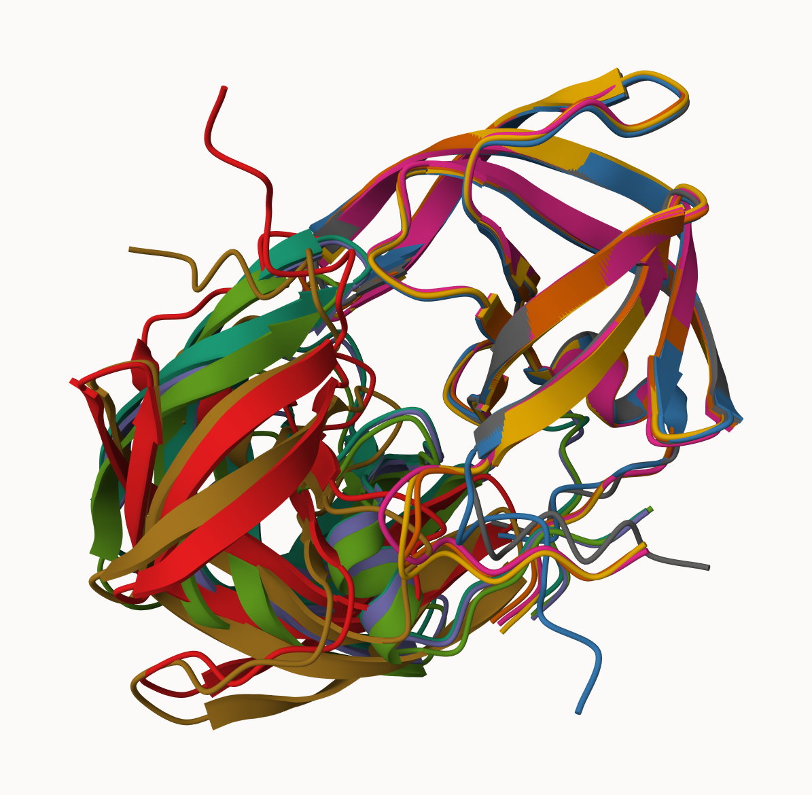
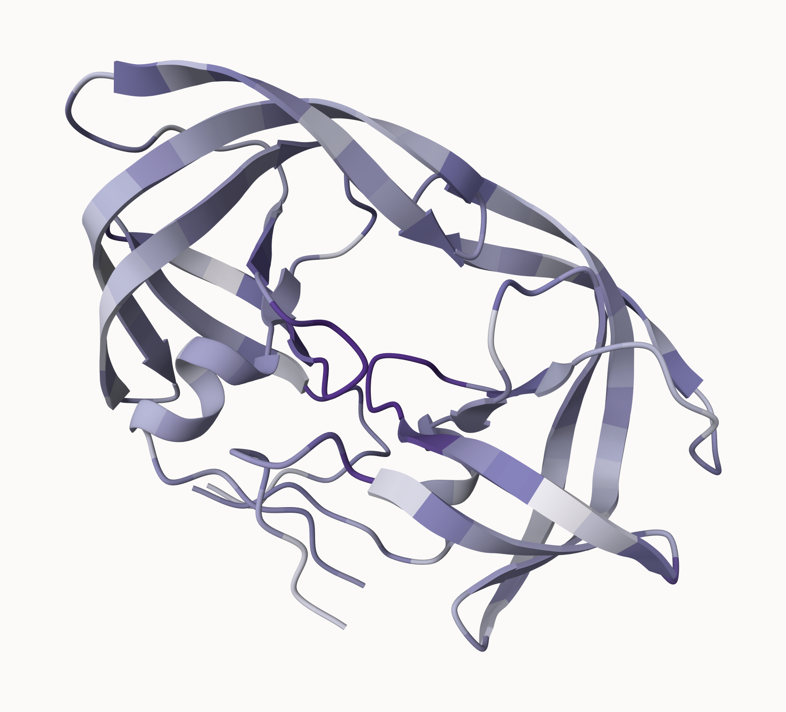

## Alpha Fold Running

This is the hivpr_dimer sequence:

PQITLWQRPLVTIKIGGQLKEALLDTGADDTVLEEMSLPGRWKPKMIGGIGGFIKVRQYDQILIEICGHKAIGTVLVGPTPVNIIGRNLLTQIGCTLNF

At <https://colab.research.google.com/github/sokrypton/ColabFold/blob/main/AlphaFold2.ipynb#scrollTo=kOblAo-xetgx> after connecting to the online cloud computing infrastructure on the top right ("connect" button).

```{r}
# library(bio3d)
# pdb_files <- list.files("hivpr_dimer_23119/", pattern=".pdb", full.names=TRUE)
# pdbs <- c()
# for (i in pdb_files){
#   pdbs <- append(pdbs, read.pdb(i))
# }
# 
# library(bio3d)
# 
# # Read all data from Models 
# #  and superpose/fit coords
# pdbs <- pdbaln(pdb_files, fit=TRUE, exefile="msa")
```

```{r}
results_dir <- "hivpr_dimer_23119/" 
# File names for all PDB models
pdb_files <- list.files(path=results_dir,
                        pattern="*.pdb",
                        full.names = TRUE)

# Print our PDB file names
basename(pdb_files)
library(bio3d)

# Read all data from Models 
#  and superpose/fit coords
pdbs <- pdbaln(pdb_files, fit=TRUE, exefile="msa")
pdbs
```

```{r}
rd <- rmsd(pdbs, fit=T) #gets a understanding of accuracy using RMSD
range(rd)
library(pheatmap)

colnames(rd) <- paste0("m",1:5)
rownames(rd) <- paste0("m",1:5)
pheatmap(rd) #generates a heatmap
```

Based on the heatmap dendrograms, we see that structure m4 and m5 are closely related and very dissimilar from m1, m2, m3, while m1 and m2 and m3 are closely related to one another. In addition, the matrix of m1, m2, m3 x m1, m2, m3 has low RMSD values, suggesting that they are very close in similarity to one another, just as how m4 and m5 share low heatmap values suggesting similarity.

```{r}
# Read a reference PDB structure
pdb <- read.pdb("1hsg")
plotb3(pdbs$b[1,], typ="l", lwd=2, sse=pdb) #plots pdb values
points(pdbs$b[2,], typ="l", col="red")
points(pdbs$b[3,], typ="l", col="blue")
points(pdbs$b[4,], typ="l", col="darkgreen")
points(pdbs$b[5,], typ="l", col="orange")
abline(v=100, col="gray") #adds a threshold line
```

```{r}
core <- core.find(pdbs) #core values yielded
core.inds <- print(core, vol=0.5) #outputted core indices
xyz <- pdbfit(pdbs, core.inds, outpath="corefit_structures") #outputs core structures
```



The image above is the core structures: 5 structures over-layed on one another.

```{r}
rf <- rmsf(xyz)

plotb3(rf, sse=pdb) #plots the rf values
abline(v=100, col="gray", ylab="RMSF") #adds line to represent a threshold limit
```

## Predicted Alignment Error for domains

```{r}
library(jsonlite)

# Listing of all PAE JSON files
pae_files <- list.files(path=results_dir,
                        pattern=".*model.*\\.json",
                        full.names = TRUE)

pae1 <- read_json(pae_files[1],simplifyVector = TRUE) #reads a JSON file, converts
#Json to a R dataframe or vector, in this case simplifyVector = TRUE flattens the data
pae5 <- read_json(pae_files[5],simplifyVector = TRUE)

attributes(pae1)
```

```{r}
# Per-residue pLDDT scores 
#  same as B-factor of PDB..
head(pae1$plddt) 
pae1$max_pae
pae5$max_pae
plot.dmat(pae1$pae, #creates a diagonal matrice, in this case it plots it afterwards
          xlab="Residue Position (i)",
          ylab="Residue Position (j)")
```

```{r}
plot.dmat(pae5$pae, #plots the PAE based on residue positions
          xlab="Residue Position (i)",
          ylab="Residue Position (j)",
          grid.col = "black",
          zlim=c(0,30)) #controls color scaling for heat plots
```

```{r}
plot.dmat(pae1$pae, 
          xlab="Residue Position (i)",
          ylab="Residue Position (j)",
          grid.col = "black",
          zlim=c(0,30))
```

```{r}
aln_file <- list.files(path=results_dir,
                       pattern=".a3m$",
                        full.names = TRUE)
aln_file
aln <- read.fasta(aln_file[1], to.upper = TRUE) #reads fasta file and then analyses it
dim(aln$ali)
sim <- conserv(aln)
plotb3(sim[1:99], sse=trim.pdb(pdb, chain="A"), #plots conservation of residues
       ylab="Conservation Score") #the trim function isolates for just chain A in the
#protein pdb file
```

```{r}
con <- consensus(aln, cutoff = 0.9) #takes consensus sequence of the alignment file
con$seq
m1.pdb <- read.pdb(pdb_files[1]) 
occ <- vec2resno(c(sim[1:99], sim[1:99]), m1.pdb$atom$resno) #matches the original
#vector to an atom-wise length of another
write.pdb(m1.pdb, o=occ, file="m1_conserv.pdb") #creates a pdb file of thee
```



The m1_conserv pdb file includes the original m1 structure as well as as metadata associating each residue with a conservation score, that the visualizer can use to color code residues with based on their conservation.
