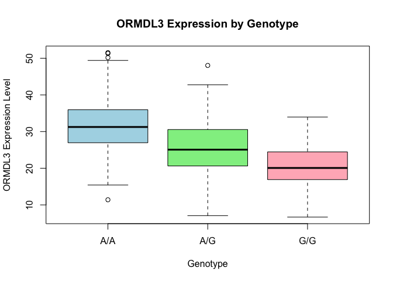

# Class 12: Genome Informatics Lab
Derek Zhang, PID: 17819201

- [Lab 12 Graphing](#lab-12-graphing)

## Lab 12 Graphing

> Q13. The sample size for each genotype is 108 for A/A genotype, 233
> for A/G genotype, and 121 for G/G genotype. The median expression
> level of genotype A/A is 31.25, A/G is 25.06, G/G is 20.07.

``` r
c12 <- read.table("class12data.txt", header = TRUE, row.names=1)
# Sample size per genotype
summary(c12)
```

        sample              geno                exp        
     Length:462         Length:462         Min.   : 6.675  
     Class :character   Class :character   1st Qu.:20.004  
     Mode  :character   Mode  :character   Median :25.116  
                                           Mean   :25.640  
                                           3rd Qu.:30.779  
                                           Max.   :51.518  

``` r
table(c12$geno) #gives number of instances (sample size) of each genotype in geno
```


    A/A A/G G/G 
    108 233 121 

``` r
tapply(c12$exp, c12$geno, median) #creates median expression of each genotype
```

         A/A      A/G      G/G 
    31.24847 25.06486 20.07363 

> Q14. The boxplot shoes that A/A has a higher median ORMDL3 expression
> than G/G and A/G, with G/G being the lowest in median ORMDL3
> expression. This means that the SNP does affect ORMDL3 expression as
> individuals with two G alleles have lower expression of ORMDL3 than
> individuals with 1 G and allele and both are lower in expression than
> individuals with 2 A alleles and no G alleles. This indicates that the
> G allele is associated with decreased expression.

``` r
boxplot(exp~geno, data = c12, # makes a boxplot
        xlab = "Genotype", #makes the x label
        ylab = "ORMDL3 Expression Level", #makes the y label
        main = "ORMDL3 Expression by Genotype",
        col = c("lightblue", "lightgreen", "lightpink"))
```


