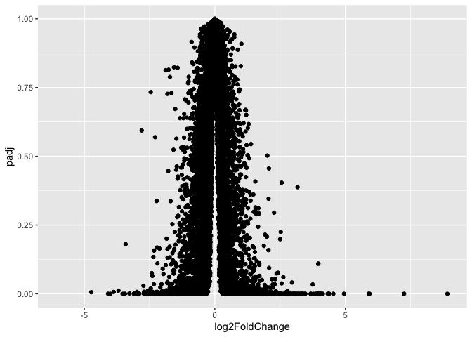
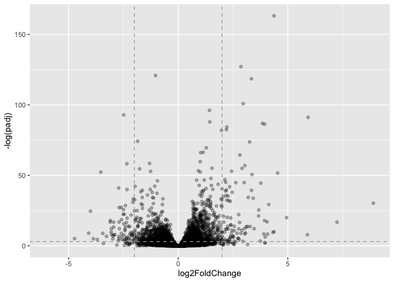

# Class 13
Derek Zhang, PID: 17819201

- [Importing data: Setup](#importing-data-setup)
- [Toy differential gene expression](#toy-differential-gene-expression)
- [Setting up for DESeq](#setting-up-for-deseq)
- [Volcano Plot](#volcano-plot)
- [Annotations DBI](#annotations-dbi)
- [Pathway Analysis](#pathway-analysis)
- [Saving our annotated results](#saving-our-annotated-results)

## Importing data: Setup

``` r
library(BiocManager)
```

    Bioconductor version '3.22' is out-of-date; the current release version '3.23'
      is available with R version '4.6'; see https://bioconductor.org/install

``` r
library(DESeq2)
```

    Loading required package: S4Vectors

    Loading required package: stats4

    Loading required package: BiocGenerics

    Loading required package: generics


    Attaching package: 'generics'

    The following objects are masked from 'package:base':

        as.difftime, as.factor, as.ordered, intersect, is.element, setdiff,
        setequal, union


    Attaching package: 'BiocGenerics'

    The following objects are masked from 'package:stats':

        IQR, mad, sd, var, xtabs

    The following objects are masked from 'package:base':

        anyDuplicated, aperm, append, as.data.frame, basename, cbind,
        colnames, dirname, do.call, duplicated, eval, evalq, Filter, Find,
        get, grep, grepl, is.unsorted, lapply, Map, mapply, match, mget,
        order, paste, pmax, pmax.int, pmin, pmin.int, Position, rank,
        rbind, Reduce, rownames, sapply, saveRDS, table, tapply, unique,
        unsplit, which.max, which.min


    Attaching package: 'S4Vectors'

    The following object is masked from 'package:utils':

        findMatches

    The following objects are masked from 'package:base':

        expand.grid, I, unname

    Loading required package: IRanges

    Loading required package: GenomicRanges

    Loading required package: Seqinfo

    Loading required package: SummarizedExperiment

    Loading required package: MatrixGenerics

    Loading required package: matrixStats


    Attaching package: 'MatrixGenerics'

    The following objects are masked from 'package:matrixStats':

        colAlls, colAnyNAs, colAnys, colAvgsPerRowSet, colCollapse,
        colCounts, colCummaxs, colCummins, colCumprods, colCumsums,
        colDiffs, colIQRDiffs, colIQRs, colLogSumExps, colMadDiffs,
        colMads, colMaxs, colMeans2, colMedians, colMins, colOrderStats,
        colProds, colQuantiles, colRanges, colRanks, colSdDiffs, colSds,
        colSums2, colTabulates, colVarDiffs, colVars, colWeightedMads,
        colWeightedMeans, colWeightedMedians, colWeightedSds,
        colWeightedVars, rowAlls, rowAnyNAs, rowAnys, rowAvgsPerColSet,
        rowCollapse, rowCounts, rowCummaxs, rowCummins, rowCumprods,
        rowCumsums, rowDiffs, rowIQRDiffs, rowIQRs, rowLogSumExps,
        rowMadDiffs, rowMads, rowMaxs, rowMeans2, rowMedians, rowMins,
        rowOrderStats, rowProds, rowQuantiles, rowRanges, rowRanks,
        rowSdDiffs, rowSds, rowSums2, rowTabulates, rowVarDiffs, rowVars,
        rowWeightedMads, rowWeightedMeans, rowWeightedMedians,
        rowWeightedSds, rowWeightedVars

    Loading required package: Biobase

    Welcome to Bioconductor

        Vignettes contain introductory material; view with
        'browseVignettes()'. To cite Bioconductor, see
        'citation("Biobase")', and for packages 'citation("pkgname")'.


    Attaching package: 'Biobase'

    The following object is masked from 'package:MatrixGenerics':

        rowMedians

    The following objects are masked from 'package:matrixStats':

        anyMissing, rowMedians

``` r
counts <- read.csv("airway_scaledcounts.csv", row.names=1)
metadata <-  read.csv("airway_metadata.csv")
head(counts)
```

                    SRR1039508 SRR1039509 SRR1039512 SRR1039513 SRR1039516
    ENSG00000000003        723        486        904        445       1170
    ENSG00000000005          0          0          0          0          0
    ENSG00000000419        467        523        616        371        582
    ENSG00000000457        347        258        364        237        318
    ENSG00000000460         96         81         73         66        118
    ENSG00000000938          0          0          1          0          2
                    SRR1039517 SRR1039520 SRR1039521
    ENSG00000000003       1097        806        604
    ENSG00000000005          0          0          0
    ENSG00000000419        781        417        509
    ENSG00000000457        447        330        324
    ENSG00000000460         94        102         74
    ENSG00000000938          0          0          0

``` r
head(metadata)
```

              id     dex celltype     geo_id
    1 SRR1039508 control   N61311 GSM1275862
    2 SRR1039509 treated   N61311 GSM1275863
    3 SRR1039512 control  N052611 GSM1275866
    4 SRR1039513 treated  N052611 GSM1275867
    5 SRR1039516 control  N080611 GSM1275870
    6 SRR1039517 treated  N080611 GSM1275871

> Q1. There are 38694 genes in the dataset.

> ``` r
> nrow(counts)
> ```
>
>     [1] 38694

> Q2. There are 4 control cell lines

> ``` r
> table(metadata$dex)
> ```
>
>
>     control treated 
>           4       4 

## Toy differential gene expression

``` r
control.inds <- metadata$dex == "control"
control.counts<- counts[ ,control.inds]
control.mean <- rowMeans(control.counts)
head(control.mean)
```

    ENSG00000000003 ENSG00000000005 ENSG00000000419 ENSG00000000457 ENSG00000000460 
             900.75            0.00          520.50          339.75           97.25 
    ENSG00000000938 
               0.75 

``` r
#no new functions here
```

``` r
library(dplyr)
```


    Attaching package: 'dplyr'

    The following object is masked from 'package:Biobase':

        combine

    The following object is masked from 'package:matrixStats':

        count

    The following objects are masked from 'package:GenomicRanges':

        intersect, setdiff, union

    The following object is masked from 'package:Seqinfo':

        intersect

    The following objects are masked from 'package:IRanges':

        collapse, desc, intersect, setdiff, slice, union

    The following objects are masked from 'package:S4Vectors':

        first, intersect, rename, setdiff, setequal, union

    The following objects are masked from 'package:BiocGenerics':

        combine, intersect, setdiff, setequal, union

    The following object is masked from 'package:generics':

        explain

    The following objects are masked from 'package:stats':

        filter, lag

    The following objects are masked from 'package:base':

        intersect, setdiff, setequal, union

``` r
control <- metadata %>% filter(dex=="control") #pipe usage from dplyr allows for
#streamlined dataframe modification and processing
control.counts <- counts %>% select(control$id)  
control.mean <- rowSums(control.counts)/4
head(control.mean)
```

    ENSG00000000003 ENSG00000000005 ENSG00000000419 ENSG00000000457 ENSG00000000460 
             900.75            0.00          520.50          339.75           97.25 
    ENSG00000000938 
               0.75 

> Q3. You can make the code above more robust by changing the hardcoded
> 4, to an adaptable version to count the number of control values:

> ``` r
> control.mean <- rowSums(control.counts)/sum(metadata$dex=="control")
> #instead of 
> control.mean <- rowSums(control.counts)/4
> ```

> Q4.

> ``` r
> treated <- metadata[metadata[,"dex"]=="treated",]
> treated.mean <- rowSums( counts[ ,treated$id] )/sum(metadata$dex=="treated")
> head(treated.mean)
> ```
>
>     ENSG00000000003 ENSG00000000005 ENSG00000000419 ENSG00000000457 ENSG00000000460 
>              658.00            0.00          546.00          316.50           78.75 
>     ENSG00000000938 
>                0.00 

Combining meancount data:

``` r
meancounts <- data.frame(control.mean, treated.mean)
head(meancounts)
```

                    control.mean treated.mean
    ENSG00000000003       900.75       658.00
    ENSG00000000005         0.00         0.00
    ENSG00000000419       520.50       546.00
    ENSG00000000457       339.75       316.50
    ENSG00000000460        97.25        78.75
    ENSG00000000938         0.75         0.00

``` r
library(ggplot2)
ggplot(meancounts, aes(y = treated.mean, x = control.mean)) +
  geom_point()
```


> Q5. `Geom_point()` is the function used to generate the dot graph.
>
> Q6. `log="xy"` is the argument to add to `plot()`

> ``` r
> plot(meancounts, log="xy")
> ```
>
>     Warning in xy.coords(x, y, xlabel, ylabel, log): 15032 x values <= 0 omitted
>     from logarithmic plot
>
>     Warning in xy.coords(x, y, xlabel, ylabel, log): 15281 y values <= 0 omitted
>     from logarithmic plot
>
> 

``` r
meancounts$log2fc <- log2(meancounts[,"treated.mean"]/meancounts[,"control.mean"]) 
head(meancounts)
```

                    control.mean treated.mean      log2fc
    ENSG00000000003       900.75       658.00 -0.45303916
    ENSG00000000005         0.00         0.00         NaN
    ENSG00000000419       520.50       546.00  0.06900279
    ENSG00000000457       339.75       316.50 -0.10226805
    ENSG00000000460        97.25        78.75 -0.30441833
    ENSG00000000938         0.75         0.00        -Inf

``` r
zero.vals <- which(meancounts[,1:2]==0, arr.ind=TRUE) #which applies a boolean to each value in a list to see
# which rows satisfy the condition

to.rm <- unique(zero.vals[,1]) #returns a vector of unique values
mycounts <- meancounts[-to.rm,]
head(mycounts)
```

                    control.mean treated.mean      log2fc
    ENSG00000000003       900.75       658.00 -0.45303916
    ENSG00000000419       520.50       546.00  0.06900279
    ENSG00000000457       339.75       316.50 -0.10226805
    ENSG00000000460        97.25        78.75 -0.30441833
    ENSG00000000971      5219.00      6687.50  0.35769358
    ENSG00000001036      2327.00      1785.75 -0.38194109

> Q7. The purpose of `arr.ind` in the `which()` function is to return
> the row and column indices for where there are the boolean true
> values, this would be necessary to avoid extracting zero values, which
> we want to avoid. Calling unique will then make sure there is no
> redundancy in counting of identical row samples.

> ``` r
> up.ind <- mycounts$log2fc > 2
> down.ind <- mycounts$log2fc < (-2)
> ```

> Q8. There are 250 up-regulated genes greater than 2-fc level

> ``` r
> sum(up.ind)
> ```
>
>     [1] 250

> Q9. There are 367 down-regulated genes.

> ``` r
> sum(down.ind)
> ```
>
>     [1] 367

> Q10. No, these results should not be trusted. The analysis only
> considers fold change magnitude, but a large fold change by itsself
> doesn’t tell us whether the difference is statistically significant.
> We have no p-values here, so we have no way of knowing if these
> expression differences are statistically significant. We need a proper
> statistical processing with DESeq before drawing any real conclusions
> about differential expression.

## Setting up for DESeq

``` r
library(DESeq2)
citation("DESeq2")
```

    To cite package 'DESeq2' in publications use:

      Love, M.I., Huber, W., Anders, S. Moderated estimation of fold change
      and dispersion for RNA-seq data with DESeq2 Genome Biology 15(12):550
      (2014)

    A BibTeX entry for LaTeX users is

      @Article{,
        title = {Moderated estimation of fold change and dispersion for RNA-seq data with DESeq2},
        author = {Michael I. Love and Wolfgang Huber and Simon Anders},
        year = {2014},
        journal = {Genome Biology},
        doi = {10.1186/s13059-014-0550-8},
        volume = {15},
        issue = {12},
        pages = {550},
      }

``` r
dds <- DESeqDataSetFromMatrix(countData=counts, #runs a DESeq dataset analysis
                              colData=metadata, 
                              design=~dex)
```

    converting counts to integer mode

    Warning in DESeqDataSet(se, design = design, ignoreRank): some variables in
    design formula are characters, converting to factors

``` r
dds
```

    class: DESeqDataSet 
    dim: 38694 8 
    metadata(1): version
    assays(1): counts
    rownames(38694): ENSG00000000003 ENSG00000000005 ... ENSG00000283120
      ENSG00000283123
    rowData names(0):
    colnames(8): SRR1039508 SRR1039509 ... SRR1039520 SRR1039521
    colData names(4): id dex celltype geo_id

``` r
#countData are gene counts across different experiments
#colData is our metadata about those count columns
```

``` r
dds <- DESeq(dds)
```

    estimating size factors

    estimating dispersions

    gene-wise dispersion estimates

    mean-dispersion relationship

    final dispersion estimates

    fitting model and testing

``` r
res <- results(dds) #results of the DESeq analysis
head(res)
```

    log2 fold change (MLE): dex treated vs control 
    Wald test p-value: dex treated vs control 
    DataFrame with 6 rows and 6 columns
                      baseMean log2FoldChange     lfcSE      stat    pvalue
                     <numeric>      <numeric> <numeric> <numeric> <numeric>
    ENSG00000000003 747.194195      -0.350703  0.168242 -2.084514 0.0371134
    ENSG00000000005   0.000000             NA        NA        NA        NA
    ENSG00000000419 520.134160       0.206107  0.101042  2.039828 0.0413675
    ENSG00000000457 322.664844       0.024527  0.145134  0.168996 0.8658000
    ENSG00000000460  87.682625      -0.147143  0.256995 -0.572550 0.5669497
    ENSG00000000938   0.319167      -1.732289  3.493601 -0.495846 0.6200029
                         padj
                    <numeric>
    ENSG00000000003  0.163017
    ENSG00000000005        NA
    ENSG00000000419  0.175937
    ENSG00000000457  0.961682
    ENSG00000000460  0.815805
    ENSG00000000938        NA

## Volcano Plot

``` r
library(ggplot2)
ggplot(res) +
  aes(x = log2FoldChange, y = padj) +
  geom_point()
```

    Warning: Removed 23549 rows containing missing values or values outside the scale range
    (`geom_point()`).



That plot is not very useful because we do not care about plots with
extremely high p-values

``` r
library(ggplot2)
ggplot(res) +
  aes(x = log2FoldChange, y = -log(padj)) + #log2FoldChange applies a logarithm sacle to a variable
  geom_point(alpha = 0.3) +
  geom_hline(yintercept=-log(0.05), col = "darkgray", linetype="dashed") + #vline and hline allow the addition
  #of a horizontal and vertical line in order to show critical cutoff values
  geom_vline(xintercept=c(-2,2), col="darkgray", linetype="dashed")
```

    Warning: Removed 23549 rows containing missing values or values outside the scale range
    (`geom_point()`).



## Annotations DBI

> Q11. Completing the code below, adding “GENENAME” and “ENTREZID” and
> “UNIPROT”

> ``` r
> library("AnnotationDbi")
> ```
>
>
>     Attaching package: 'AnnotationDbi'
>
>     The following object is masked from 'package:dplyr':
>
>         select
>
> ``` r
> library("org.Hs.eg.db")
> ```
>
> ``` r
> columns(org.Hs.eg.db)
> ```
>
>      [1] "ACCNUM"       "ALIAS"        "ENSEMBL"      "ENSEMBLPROT"  "ENSEMBLTRANS"
>      [6] "ENTREZID"     "ENZYME"       "EVIDENCE"     "EVIDENCEALL"  "GENENAME"    
>     [11] "GENETYPE"     "GO"           "GOALL"        "IPI"          "MAP"         
>     [16] "OMIM"         "ONTOLOGY"     "ONTOLOGYALL"  "PATH"         "PFAM"        
>     [21] "PMID"         "PROSITE"      "REFSEQ"       "SYMBOL"       "UCSCKG"      
>     [26] "UNIPROT"     
>
> ``` r
> res$entrez <- mapIds(org.Hs.eg.db,
>                      keys=row.names(res),
>                      column="ENTREZID",
>                      keytype="ENSEMBL",
>                      multiVals="first")
> ```
>
>     'select()' returned 1:many mapping between keys and columns
>
> ``` r
> res$uniprot <- mapIds(org.Hs.eg.db,
>                      keys=row.names(res),
>                      column="UNIPROT",
>                      keytype="ENSEMBL",
>                      multiVals="first")
> ```
>
>     'select()' returned 1:many mapping between keys and columns
>
> ``` r
> res$genename <- mapIds(org.Hs.eg.db,
>                      keys=row.names(res),
>                      column="GENENAME",
>                      keytype="ENSEMBL",
>                      multiVals="first")
> ```
>
>     'select()' returned 1:many mapping between keys and columns
>
> ``` r
> head(res, 10)
> ```
>
>     log2 fold change (MLE): dex treated vs control 
>     Wald test p-value: dex treated vs control 
>     DataFrame with 10 rows and 9 columns
>                        baseMean log2FoldChange     lfcSE      stat    pvalue
>                       <numeric>      <numeric> <numeric> <numeric> <numeric>
>     ENSG00000000003  747.194195      -0.350703  0.168242 -2.084514 0.0371134
>     ENSG00000000005    0.000000             NA        NA        NA        NA
>     ENSG00000000419  520.134160       0.206107  0.101042  2.039828 0.0413675
>     ENSG00000000457  322.664844       0.024527  0.145134  0.168996 0.8658000
>     ENSG00000000460   87.682625      -0.147143  0.256995 -0.572550 0.5669497
>     ENSG00000000938    0.319167      -1.732289  3.493601 -0.495846 0.6200029
>     ENSG00000000971 5760.148362       0.459282  0.234318  1.960081 0.0499864
>     ENSG00000001036 2025.391794      -0.228244  0.124999 -1.825965 0.0678555
>     ENSG00000001084  652.173308      -0.253031  0.202576 -1.249064 0.2116417
>     ENSG00000001167  411.684395      -0.533733  0.228792 -2.332831 0.0196570
>                          padj      entrez     uniprot               genename
>                     <numeric> <character> <character>            <character>
>     ENSG00000000003  0.163017        7105  A0A087WYV6          tetraspanin 6
>     ENSG00000000005        NA       64102      Q9H2S6            tenomodulin
>     ENSG00000000419  0.175937        8813      H0Y368 dolichyl-phosphate m..
>     ENSG00000000457  0.961682       57147      X6RHX1 SCY1 like pseudokina..
>     ENSG00000000460  0.815805       55732      A6NFP1 FIGNL1 interacting r..
>     ENSG00000000938        NA        2268      B7Z6W7 FGR proto-oncogene, ..
>     ENSG00000000971  0.200967        3075      A5PL14    complement factor H
>     ENSG00000001036  0.246740        2519      E9PEB6   alpha-L-fucosidase 2
>     ENSG00000001084  0.495029        2729  A0A2R8YEL6 glutamate-cysteine l..
>     ENSG00000001167  0.105242        4800      P23511 nuclear transcriptio..

## Pathway Analysis

``` r
library(pathview)
```

    ##############################################################################
    Pathview is an open source software package distributed under GNU General
    Public License version 3 (GPLv3). Details of GPLv3 is available at
    http://www.gnu.org/licenses/gpl-3.0.html. Particullary, users are required to
    formally cite the original Pathview paper (not just mention it) in publications
    or products. For details, do citation("pathview") within R.

    The pathview downloads and uses KEGG data. Non-academic uses may require a KEGG
    license agreement (details at http://www.kegg.jp/kegg/legal.html).
    ##############################################################################

``` r
library(gage)
```

``` r
library(gageData)

data(kegg.sets.hs)

# Examine the first 2 pathways in this kegg set for humans
head(kegg.sets.hs, 2)
```

    $`hsa00232 Caffeine metabolism`
    [1] "10"   "1544" "1548" "1549" "1553" "7498" "9"   

    $`hsa00983 Drug metabolism - other enzymes`
     [1] "10"     "1066"   "10720"  "10941"  "151531" "1548"   "1549"   "1551"  
     [9] "1553"   "1576"   "1577"   "1806"   "1807"   "1890"   "221223" "2990"  
    [17] "3251"   "3614"   "3615"   "3704"   "51733"  "54490"  "54575"  "54576" 
    [25] "54577"  "54578"  "54579"  "54600"  "54657"  "54658"  "54659"  "54963" 
    [33] "574537" "64816"  "7083"   "7084"   "7172"   "7363"   "7364"   "7365"  
    [41] "7366"   "7367"   "7371"   "7372"   "7378"   "7498"   "79799"  "83549" 
    [49] "8824"   "8833"   "9"      "978"   

``` r
foldchanges = res$log2FoldChange
names(foldchanges) = res$entrez
head(foldchanges)
```

           7105       64102        8813       57147       55732        2268 
    -0.35070296          NA  0.20610728  0.02452701 -0.14714263 -1.73228897 

``` r
# Get the results
keggres = gage(foldchanges, gsets=kegg.sets.hs)
```

``` r
attributes(keggres)
```

    $names
    [1] "greater" "less"    "stats"  

``` r
# Look at the first three down (less) pathways
head(keggres$less, 3)
```

                                          p.geomean stat.mean        p.val
    hsa05332 Graft-versus-host disease 0.0004250607 -3.473335 0.0004250607
    hsa04940 Type I diabetes mellitus  0.0017820379 -3.002350 0.0017820379
    hsa05310 Asthma                    0.0020046180 -3.009045 0.0020046180
                                            q.val set.size         exp1
    hsa05332 Graft-versus-host disease 0.09053792       40 0.0004250607
    hsa04940 Type I diabetes mellitus  0.14232788       42 0.0017820379
    hsa05310 Asthma                    0.14232788       29 0.0020046180

``` r
pathview(gene.data=foldchanges, pathway.id="hsa05310")
```

    'select()' returned 1:1 mapping between keys and columns

    Info: Working in directory /Users/derke/Desktop/BIMM 143/bimm143_git/Class 13

    Info: Writing image file hsa05310.pathview.png

> Q12. The top 2 down-regulated pathways from `keggres$less` are
> hsa05332 (Graft-versus-host disease) and hsa04940 (Type I diabetes
> mellitus).

> ``` r
> # Pathview figures for top 2 down-regulated pathways
> pathview(gene.data=foldchanges, pathway.id="hsa05332")
> ```
>
>     'select()' returned 1:1 mapping between keys and columns
>
>     Info: Working in directory /Users/derke/Desktop/BIMM 143/bimm143_git/Class 13
>
>     Info: Writing image file hsa05332.pathview.png
>
> ``` r
> pathview(gene.data=foldchanges, pathway.id="hsa04940")
> ```
>
>     'select()' returned 1:1 mapping between keys and columns
>
>     Info: Working in directory /Users/derke/Desktop/BIMM 143/bimm143_git/Class 13
>
>     Info: Writing image file hsa04940.pathview.png


## Saving our annotated results

``` r
write.csv(res, file="myresults_annotated.csv")
```
