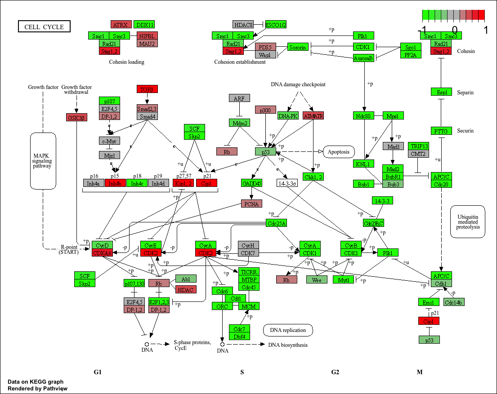

## Data Import

```{r}
metaFile <- "GSE37704_metadata.csv"
countFile <- "GSE37704_featurecounts.csv"

# Import metadata and take a peek
colData = read.csv(metaFile, row.names=1)
head(colData)
countData = read.csv(countFile, row.names=1)
head(countData)
```

> Q. Complete code below to remove troublesome first column
>
> ```{r}
> # Note we need to remove the odd first $length col
> countData <- as.matrix(countData[,-1])
> head(countData)
> ```
>
> Q. Complete the code below to filter countData to exclude genes where they have a 0 count across all samples
>
> ```{r}
> # Filter count data where you have 0 read count across all samples.
> countData = countData[rowSums(countData)!= 0, ]
> head(countData)
> colData
> ```

## Sanity Check

## Setup DESeq object

```{r}
library("DESeq2")
#generates a DESeq dataset to be further processed below
dds = DESeqDataSetFromMatrix(countData=countData,
                             colData=colData,
                             design=~condition)
dds = DESeq(dds)
dds
```

## Run DESeq analysis pipeline

```{r}
res = results(dds)
```

> Q. Call the summary() function
>
> ```{r}
> summary(res)
> ```

## Extract the results

## Data visualization

```{r}
library(ggplot2)
ggplot(res) +
  aes(x = log2FoldChange, y = -log(padj)) +
  geom_point()
```

> Q. Improve the plot
>
> ```{r}
> # Make a color vector for all genes
> mycols <- rep("grey", nrow(res))
> >
> # Color blue the genes with fold change above 2
> mycols[ abs(res$log2FoldChange) > 2 ] <- "blue"
> >
> # Color gray those with adjusted p-value more than 0.01
> mycols[ res$padj > 0.01 ] <- "gray"
> >
> ggplot(res) +
>   aes(log2FoldChange,
>       -log(padj)) +
>   geom_point(color=mycols) +
>   xlab("Log2(FoldChange)") +
>   ylab("-Log(P-value)") +
>   geom_vline(xintercept = c(-2,2)) +
>   geom_hline(yintercept = -log(0.05))
> ```

## Add annotation data

> Q. Use mapIDs to add symbol, ENTREZID and GENENAME
>
> ```{r}
> library("AnnotationDbi")
> library("org.Hs.eg.db")
> >
> columns(org.Hs.eg.db)
> >
> #mapIds is from the annotationDbi library for the purpose of mapping gene IDs to other data
> res$symbol = mapIds(org.Hs.eg.db,
>                     keys=row.names(res), 
>                     keytype="ENSEMBL",
>                     column="SYMBOL",
>                     multiVals="first")
> >
> res$entrez = mapIds(org.Hs.eg.db,
>                     keys=row.names(res),
>                     keytype="ENSEMBL",
>                     column="ENTREZID",
>                     multiVals="first")
> >
> res$name =   mapIds(org.Hs.eg.db,
>                     keys=row.names(res),
>                     keytype="ENSEMBL",
>                     column="GENENAME",
>                     multiVals="first")
> >
> head(res, 10)
> ```
>
> Q. Reorder by adjusted p-values
>
> ```{r}
> res = res[order(res$pvalue),]
> #generates and saves a csv as a file to your computer
> write.csv(res, file="deseq_results.csv")
> ```

## Pathway analysis

```{r}
library(pathview)
library(gage)
library(gageData)

data(kegg.sets.hs)
data(sigmet.idx.hs)

# Focus on signaling and metabolic pathways only
kegg.sets.hs = kegg.sets.hs[sigmet.idx.hs]

# Examine the first 3 pathways
head(kegg.sets.hs, 3)

foldchanges = res$log2FoldChange
names(foldchanges) = res$entrez
head(foldchanges)

# Get the results
keggres = gage(foldchanges, gsets=kegg.sets.hs)

attributes(keggres)

# Look at the first few down (less) pathways
head(keggres$less)

pathview(gene.data=foldchanges, pathway.id="hsa04110")
```



```{r}
## Focus on top 5 upregulated pathways here for demo purposes only
keggrespathways <- rownames(keggres$greater)[1:5]

# Extract the 8 character long IDs part of each string
keggresids = substr(keggrespathways, start=1, stop=8)
keggresids
pathview(gene.data=foldchanges, pathway.id=keggresids, species="hsa")
```


> Q. Do the same for the top 5 down-regulated pathways
>
> ```{r}
> keggrespathways_lower <- rownames(keggres$less)[1:5]
> >
> # Extract the 8 character long IDs part of each string
> keggresids_lower = substr(keggrespathways_lower, start=1, stop=8)
> keggresids_lower
> pathview(gene.data=foldchanges, pathway.id=keggresids_lower, species="hsa")
> ```


](images/clipboard-4257486082.png)


## Gene Ontology

```{r}
data(go.sets.hs)
data(go.subs.hs)

# Focus on Biological Process subset of GO
gobpsets = go.sets.hs[go.subs.hs$BP]

gobpres = gage(foldchanges, gsets=gobpsets)

lapply(gobpres, head)
```

## Reactome Analysis

```{r}
sig_genes <- res[res$padj <= 0.05 & !is.na(res$padj), "symbol"]
print(paste("Total number of significant genes:", length(sig_genes)))
write.table(sig_genes, file="significant_genes.txt", row.names=FALSE, col.names=FALSE, quote=FALSE)
```

> Q. The cell cycle had the most significant/lowest "Entities p-value" at 2.63E-5. This does match because H04110 was the most downregulated pathway, with the most significant difference, and that pathway is a cell cycle pathway, suggesting a match between KEGG analysis and reactome pathway analysis. Something that could make a difference is the way the databases are setup, such that some pathways include more interactions and other pathways less, so if each pathway describes slightly different processes then that difference in description can lead to different p-values in analysis due to different interactions.
