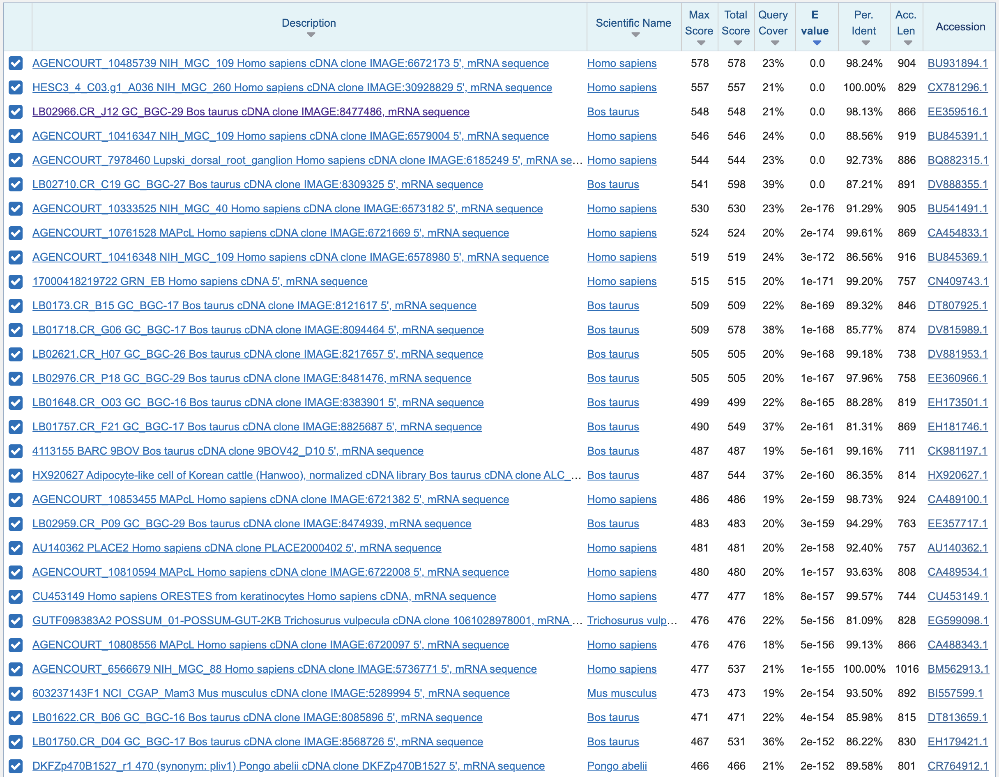
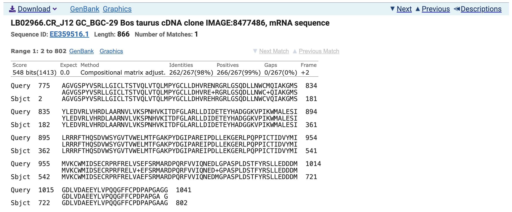
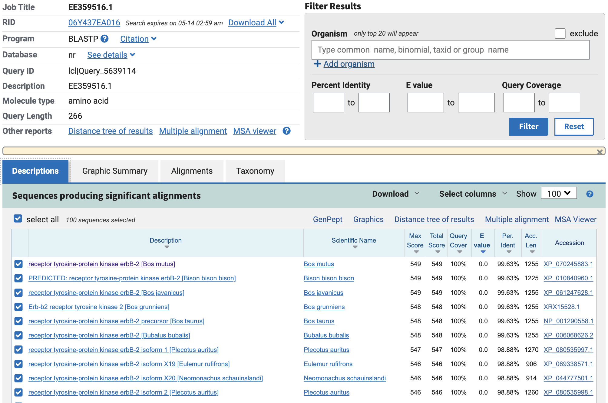
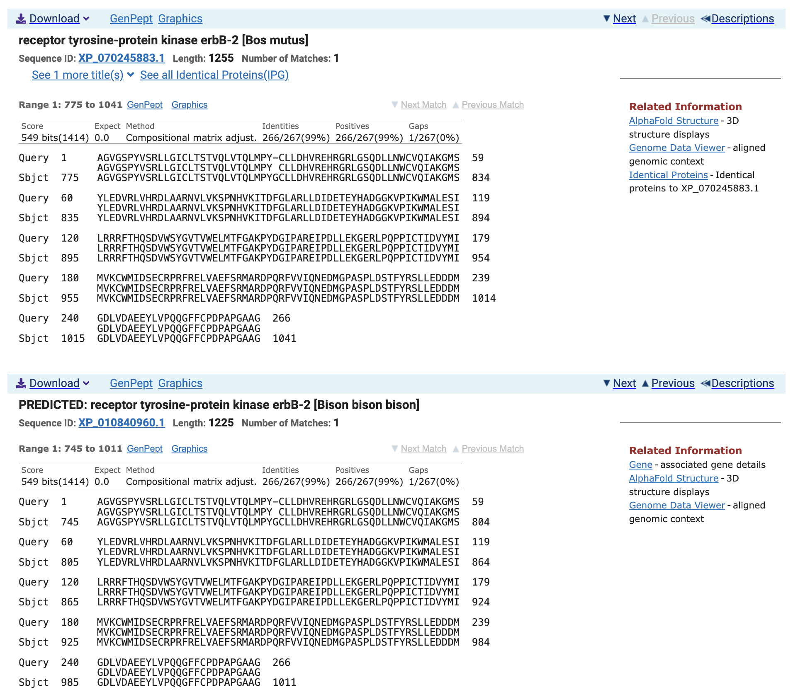
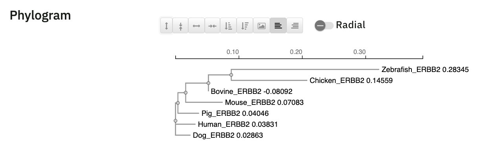

## Q1 -\> ERBB2

The protein I am interested is ERBB2 protein, or clinically known as HER2. This is otherwise called erb-b2 receptor tyrosine kinase. ERBB2 protein is critical protein that acts as a epidermal growth factor receptor, gating downstream cell proliferation signals and cell proliferation outcomes.

The accession number is NM_004448.4, and the uniprot code is P04626.

## Q2 -\> tBLASTn

Species: Didn't have one in my search.

Method: TBLASTN (2.17.0) searched against no organism filter at first

Database: Expressed Sequence Tags (est)


\>ERBB2_sequence

MELAALCRWGLLLALLPPGAASTQVCTGTDMKLRLPASPETHLDMLRHLYQGCQVVQGNLELTYLPTNASLSFLQDIQEVQGYVLIAHNQVRQVPLQRLRIVRGTQLFEDNYALAVLDNGDPLNNTTPVTGASPGGLRELQLRSLTEILKGGVLIQRNPQLCYQDTILWKDIFHKNNQLALTLIDTNRSRACHPCSPMCKGSRCWGESSEDCQSLTRTVCAGGCARCKGPLPTDCCHEQCAAGCTGPKHSDCLACLHFNHSGICELHCPALVTYNTDTFESMPNPEGRYTFGASCVTACPYNYLSTDVGSCTLVCPLHNQEVTAEDGTQRCEKCSKPCARVCYGLGMEHLREVRAVTSANIQEFAGCKKIFGSLAFLPESFDGDPASNTAPLQPEQLQVFETLEEITGYLYISAWPDSLPDLSVFQNLQVIRGRILHNGAYSLTLQGLGISWLGLRSLRELGSGLALIHHNTHLCFVHTVPWDQLFRNPHQALLHTANRPEDECVGEGLACHQLCARGHCWGPGPTQCVNCSQFLRGQECVEECRVLQGLPREYVNARHCLPCHPECQPQNGSVTCFGPEADQCVACAHYKDPPFCVARCPSGVKPDLSYMPIWKFPDEEGACQPCPINCTHSCVDLDDKGCPAEQRASPLTSIISAVVGILLVVVLGVVFGILIKRRQQKIRKYTMRRLLQETELVEPLTPSGAMPNQAQMRILKETELRKVKVLGSGAFGTVYKGIWIPDGENVKIPVAIKVLRENTSPKANKEILDEAYVMAGVGSPYVSRLLGICLTSTVQLVTQLMPYGCLLDHVRENRGRLGSQDLLNWCMQIAKGMSYLEDVRLVHRDLAARNVLVKSPNHVKITDFGLARLLDIDETEYHADGGKVPIKWMALESILRRRFTHQSDVWSYGVTVWELMTFGAKPYDGIPAREIPDLLEKGERLPQPPICTIDVYMIMVKCWMIDSECRPRFRELVSEFSRMARDPQRFVVIQNEDLGPASPLDSTFYRSLLEDDDMGDLVDAEEYLVPQQGFFCPDPAPGAGGMVHHRHRSSSTRSGGGDLTLGLEPSEEEAPRSPLAPSEGAGSDVFDGDLGMGAAKGLQSLPTHDPSPLQRYSEDPTVPLPSETDGYVAPLTCSPQPEYVNQPDVRPQPPSPREGPLPAARPAGATLERPKTLSPGKNGVVKDVFAFGGAVENPEYLTPQGGAAPQPHPPPAFSPAFDNLYYWDQDPPERGAPPSTFKGTPTAENPEYLGLDVPV

Above is the amino acid sequence of ERBB2 extracted from uniprot.

This sequence was pasted into the tBLASTn search. The expressed sequence tags (est) database was used with no organism filter.



The sequence we will inspect is the third outcome, the Bos taurus (taxid: 9913) cDNA clone mRNA sequence, with a 0.0 E value, 98.13% identity at 21% query coverage, with a total score of 548. mRNA Accession: **EE359516.1**



## Q3 -\> Novel Protein Information

\>EE359516.1_Bos_taurus_cDNA_clone AGVGSPYVSRLLGICLTSTVQLVTQLMPYCLLDHVREHRGRLGSQDLLNWCVQIAKGMSYLEDVRLVHRDLAARNVLVKSPNHVKITDFGLARLLDIDETEYHADGGKVPIKWMALESILRRRFTHQSDVWSYGVTVWELMTFGAKPYDGIPAREIPDLLEKGERLPQPPICTIDVYMIMVKCWMIDSECRPRFRELVAEFSRMARDPQRFVVIQNEDMGPASPLDSTFYRSLLEDDDMGDLVDAEEYLVPQQGFFCPDPAPGAAG

This protein seems to have no official name that can be easily located. It could be called a ERBB2/HER2 homolog in Bos taurus.

The novel protein appears to be a potential homolog of ERBB2/HER2 in Bos taurus, identified from an unannotated EST clone of genbank EST accession EE359516.1.

## Q4 -\> Novel Protein Information




These are the top protein alignments. The top match is \<100% identity, at 99.63%. This is a very high match but not 100% so I will take that to indicate that this is a novel protein. Fish has validated this!



## Q5 -\> Alignment

\>Human_ERBB2 gi\|NP_004439.2\| erb-b2 receptor tyrosine kinase 2 \[Homo sapiens\] MELAALCRWGLLLALLPPGAASTQVCTGTDMKLRLPASPETHLDMLRHLYQGCQVVQGNLELTYLPTNASLSFLQDIQEVQGYVLIAHNQVRQVPLQRLRIVRGTQLFEDNYALAVLDNGDPLNNTTPVTGASPGGLRELQLRSLTEILKGGVLIQRNPQLCYQDTILWKDIFHKNNQLALTLIDTNRSRACHPCSPMCKGSRCWGESSEDCQSLTRTVCAGGCARCKGPLPTDCCHEQCAAGCTGPKHSDCLACLHFNHSGICELHCPALVTYNTDTFESMPNPEGRYTFGASCVTACPYNYLSTDVGSCTLVCPLHNQEVTAEDGTQRCEKCSKPCARVCYGLGMEHLREVRAVTSANIQEFAGCKKIFGSLAFLPESFDGDPASNTAPLQPEQLQVFETLEEITGYLYISAWPDSLPDLSVFQNLQVIRGRILHNGAYSLTLQGLGISWLGLRSLRELGSGLALIHHNTHLCFVHTVPWDQLFRNPHQALLHTANRPEDECVGEGLACHQLCARGHCWGPGPTQCVNCSQFLRGQECVEECRVLQGLPREYVNARHCLPCHPECQPQNGSVTCFGPEADQCVACAHYKDPPFCVARCPSGVKPDLSYMPIWKFPDEEGACQPCPINCTHSCVDLDDKGCPAEQRASPLTSIISAVVGILLVVVLGVVFGILIKRRQQKIRKYTMRRLLQETELVEPLTPSGAMPNQAQMRILKETELRKVKVLGSGAFGTVYKGIWIPDGENVKIPVAIKVLRENTSPKANKEILDEAYVMAGVGSPYVSRLLGICLTSTVQLVTQLMPYGCLLDHVRENRGRLGSQDLLNWCMQIAKGMSYLEDVRLVHRDLAARNVLVKSPNHVKITDFGLARLLDIDETEYHADGGKVPIKWMALESILRRRFTHQSDVWSYGVTVWELMTFGAKPYDGIPAREIPDLLEKGERLPQPPICTIDVYMIMVKCWMIDSECRPRFRELVSEFSRMARDPQRFVVIQNEDLGPASPLDSTFYRSLLEDDDMGDLVDAEEYLVPQQGFFCPDPAPGAGGMVHHRHRSSSTRSGGGDLTLGLEPSEEEAPRSPLAPSEGAGSDVFDGDLGMGAAKGLQSLPTHDPSPLQRYSEDPTVPLPSETDGYVAPLTCSPQPEYVNQPDVRPQPPSPREGPLPAARPAGATLERPKTLSPGKNGVVKDVFAFGGAVENPEYLTPQGGAAPQPHPPPAFSPAFDNLYYWDQDPPERGAPPSTFKGTPTAENPEYLGLDVPV

\>Bovine_ERBB2 (sequence taken from BLAST result, EE359516.1)

AGVGSPYVSRLLGICLTSTVQLVTQLMPYCLLDHVREHRGRLGSQDLLNWCVQIAKGMSYLEDVRLVHRDLAARNVLVKSPNHVKITDFGLARLLDIDETEYHADGGKVPIKWMALESILRRRFTHQSDVWSYGVTVWELMTFGAKPYDGIPAREIPDLLEKGERLPQPPICTIDVYMIMVKCWMIDSECRPRFRELVAEFSRMARDPQRFVVIQNEDMGPASPLDSTFYRSLLEDDDMGDLVDAEEYLVPQQGFFCPDPAPGAAG

\>Dog_ERBB2 gi\|NP_001003217.3\| receptor tyrosine-protein kinase erbB-2 precursor \[Canis lupus familiaris\]

MELAAWCRWGLLLALLPSGAAGTQVCTGTDMKLRLPASPETHLDMLRHLYQGCQVVQGNLELTYLPANASLSFLQDIQEVQGYVLIAHSQVRQIPLQRLRIVRGTQLFEDNYALAVLDNGDPLEGGIPAPGAAPGGLRELQLRSLTEILKGGVLIQRSPQLCHQDTILWKDVFHKNNQLALTLIDTNRSRACPPCSPACKDAHCWGASSGDCQSLTRTVCAGGCARCKGPQPTDCCHEQCAAGCTGPKHSDCLACLHFNHSGICELHCPALVTYNTDTFESMPNPEGRYTFGASCVTSCPYNYLSTDVGSCTLVCPLNNQEVTAEDGTQRCEKCSKPCARVCYGLGMEHLREVRAVTSANIQEFAGCKKIFGSLAFLPESFEGDPASNTAPLQPEQLRVFEALEEITGYLYISAWPDSLPNLSVFQNLRVIRGRVLHDGAYSLTLQGLGISWLGLRSLRELGSGLALIHRNARLCFVHTVPWDQLFRNPHQALLHSANRPEEECVGEGLACYPLCAHGHCWGPGPTQCVNCSQFLRGQECVEECRVLQGLPREYVKDRYCLPCHSECQPQNGSVTCFGSEADQCVACAHYKDPPFCVARCPSGVKPDLSFMPIWKFADEEGTCQPCPINCTHSCADLDEKGCPAEQRASPVTSIIAAVVGILLAVVVGLVLGILIKRRRQKIRKYTMRRLLQETELVEPLTPSGAMPNQAQMRILKETELRKVKVLGSGAFGTVYKGIWIPDGENVKIPVAIKVLRENTSPKANKEILDEAYVMAGVGSPYVSRLLGICLTSTVQLVTQLMPYGCLLDHVREHRGRLGSQDLLNWCVQIAKGMSYLEDVRLVHRDLAARNVLVKSPNHVKITDFGLARLLDIDETEYHADGGKVPIKWMALESILRRRFTHQSDVWSYGVTVWELMTFGAKPYDGIPAREIPDLLEKGERLPQPPICTIDVYMIMVKCWMIDSECRPRFRELVAEFSRMARDPQRFVVIQNEDLGPASPLDSTFYRSLLEDDDMGDLVDAEEYLVPQQGFFCPEPTPGAGGTAHRRHRSSSTRSGGGELTLGLEPSEEEPPKSPLAPSEGAGSDVFDGDLGMGAAKGLQSLPSQDPSPLQRYSEDPTVPLPPETDGYVAPLTCSPQPEYVNQPEVWPQPPSPLEGPLPPSRPAGATLERPKTLSPKTLSPGKNGVVKDVFAFGSAVENPEYLAPRGRAAPQPHPPPAFSPAFDNLYYWDQDPSERGSPPSTFEGTPTAENPEYLGLDVPV

\>Chicken_ERBB2 gi\|NP_001038126.2\| receptor tyrosine-protein kinase erbB-2 precursor \[Gallus gallus\]

MIAARGRPLCPALLPPLLLAALCPAAAAEVCTGTDMKLLQPSSPESHYETLRHLYQGCQVVQGNLELTYLPPGADTAFLQDIKEVQGYVLIAENHVSAVGLQGLRIIRGTQLFQERYALAVLGNVGLRQLGMRQLTEILKGGVHIEGNPQLCFQETILWADIFHRHNELRSETHVESTRSRTCPDCRALCAEGHCWGESPQDCQTLTNSICHGCPRCKGTKPTDCCHEQCAAGCTGPKHSDCLACLNFNRSGICELHCPPLVIYNSDTFESVPNRDGRYTFGASCVSQCPYNYLATEVGSCTLVCPQNSQEVTVNNVQKCEKCSKPCPEVCYGLGVDFLKGVRAVNASNIRXFAGCTKIFGSLAFLPETFAGDPSTNTAPLDPQLLSVFESLEELTGYLYIAAWPPGMDDLGVFQNLRVIRGRVLHNGAYSLTLQDLAVRALGLRALQEISSGMVLIHHNPQLCFLQKVPWDSIFRHPRQHLFQTHNKAPEQCESDGLVCFHLCAHGHCWGPGPTQCVSCERFLRGQECVASCNLLDGATREHANGTRCLPCHPECQPQNGTETCFGSDADQCVACAHYKDGQQCVRRCPSGVKVDASFVPIWKYPDEEGVCQLCPTNCTHSCTIRDEDGCPVDQKPSQVTSIIAGVVGALLVVVLLLITVVCVKRRRQQERKHTMRRLLQETELVEPLTPSGALPNQAQMRILKETELKKVKVLGSGAFGTVYKGIWIPDGESVKIPVAIKVLRENTSPKANKEILDEAYVMAGVGSPYVSRLLGICLTSTVQLVTQLMPYGCLLDYVRENKDRIGSQDLLNWCVQIAKGMSYLEEVRLVHRDLAARNVLVKSPNHVKITDFGLARLLDIDETEYHADGGKVPIKWMALESILRRRFTHQSDVWSYGVTVWELMTFGAKPYDGIPAREIPDLLEKGERLPQPPICTIDVYMIMVKCWMIDSECRPKFRELVTEFSRMARDPQRFVVIQNDTIGLPSSMDSTFYRALLEEEDMDDLVDAEEYLVPHQGFFSAETSTAYRSRISSTRSTAETPADTTEGEE SAAFPFPPQSLVEGPECPVPEALEVDGGAKGALPSPPATRYSEDPTALPGDESEGLDPEGFATPGAHATMPEYVNQAGERPSPPRHPCAPPSPPDKPKGHQGKNGLIKDTKHPFLGPFGRAVENPEYLAPPGLPAPTAFSQAFDNPYYWNQDPPKAGSPEGGPSSTPAAENPEYLGLAEPEDVAV

\>Pig_ERBB2 gi\|NP_001302542.1\| receptor tyrosine-protein kinase erbB-2 precursor \[Sus scrofa\]

MELAAWCRWGLLLALLPPGAASTQVCTGTDMKLQLPASPETHLDMLRHLYQGCQVVQGNLELTYLPANANLFFLQEIQEVQGYVLIAHNRVSRVPLQRLRIVRGTQLFEDRYALAVLDNGDLLESATPAAGAAAEGLQELQLQSLTEILKGGVLIQRNPQLCHQDTILWKDIFHKNNPLTTVAVEANRSRACPPCSPACKASHCWGESSKDCQSLTRTICAGGCARCKGPLPTDCCHEQCAAGCTGPKHSDCLACFHFNHSGICELHCPALVTYNTDTFESMPNPEGRYTFGASCVTACPYNYLSTDVGSCTLVCPPNNQEVTAEDGTQRCEKCSKPCAQVCYGLGIEHLREVRAVTSANIQEFAGCRKIFGSLAFLPESFEGDPASSTAPLQPEQLRVFETLEEITGYLYISAWPDSLPDLSVFQNLRVIRGRVLHDGAYSLTLQGLGISWLGLRSLRELGSGLALIHRNARLCFVHTVPWDQLFRNPHQALLHSANRPEEECVGEGLTCYQLCAHGHCWGPGPTQCVNCSQFLRGQECVKECRVQQGHPREYVKDRYCLPCHPECQPQNGSDTCFGSEADQCVACAHYKDPPFCVARCPSGVKPDLSFMPIWKFPDEDGMCQPCPINCTHSCVDLDDKGCPAEQRASPASSIIAGVVGVLLAAVIGVVFGTLIKRRRQKIRKYTMRRLLQETELVEPLTPSGAMPNQAQMRILKETELRKVKVLGSGAFGTVYKGIWIPDGENVKIPVAIKVLRENTSPKANKEILDEAYVMAGVGSPYVSRLLGICLTSTVQLVTQLMPYGCLLDHVREHRGRLGSQDLLNWCVQIAKGMSYLEDVRLVHRDLAARNVLVKSPNHVKITDFGLARLLDIDETEYHADGGKVPIKWMALESILRRRFTHQSDVWSYGVTVWELMTFGAKPYDGIPAREIPDLLEKGERLPQPPICTIDVYMIMVKCWMIDSECRPRFRELVAEFSRMARDPQRFVVIQNEDLGPASPLDSTFYRSLLEDDDMGDLVDAEEYLVPQQGFFCPDPAPGAGGTAHRRHRST STRSGGGELTLGLEASEEEPPKSPLAPSEGAGSDVFDGDLGMGAAKGLQNLPQHDSSPLQRYSEDPTVPLPPETDGYVAPLTCSPQPEYVNQPEVRPQPPSPLEGPLPPPRPTGATLERPKTLSPGRNGVVKDVFAFGAAVENPEYLAPRGRAPSQNHPSPAFSPAFDNLYYWDQDPSDRGALPSTFEGTPTAENPEYLGLDVPV

\>Zebrafish_ERBB2 gi\|NP_956413.2\| receptor tyrosine-protein kinase erbB-2 precursor \[Danio rerio\]

MEADRSFGLAWVLLLLLGITAATGREVCLGTDMKLALPSSLENHYEMLRLLYTGCQVVHGNLEITHLQGNPDLSFLQEIVEVQGYVLIAHVSVRSLPLDNLRIIRGSQLYKSNYALAVHNNSNSSQAGLGLRELRLRSLTEILLGGVYIWGNPQLCFPRNINWEDTVSKVQNKPLHLQDIPKNCPRCSSACKSGGCWGEKDQDCQTLTSVNCSSGCSRCKGPKPSDCCHVQCAAGCTGPKDSDCLACRHFNDSGTCKDSCPPPTIYDPITFQSKPNKDKKFSFGATCVKQCPHNYLAMEVACTMVCPKANKEVISVEPDGQETQKCEKCEGECPKVCYGLGMGNLQGVSVVNSTNIGMFTGCEKIYGSLAFLSDSFKGNADTNSSGLQPSDLEKLKTIEEITGYLYIDAWSENLLDLSVFENLKVIRGQMLYKGVFSLGVQSLQIESLGLRSLRSVSGGLVLIHNNSRLCYTSSLPWTSLLHPTQGPNLISNNNKDQQTCVSEGKICDPLCGDSGCWGPGPSQCVSCLNYKRGTECVELCNVLHGSVREFEDGFNCVPCHPECRPINGTASCTGPGPDQCTDCMHFQDGDVCVERCPSGVKEEQHTVWKYSNATGHCLPCETNCTVSCPLDDRGCPIQQKTGPGTTVAITVGGVLLFIILLALLVFYLRRQKHQKKKETIRRRLQEHELVEPLTPSGAMPNQAQMRILKETELKKLRVLGSGAFGTVFKGIWAPDGENVRIPVAIKVLRENTSPKANKEILDEAYVMAGVASPYVCRLLGICLTSTVQLVTQLMPYGCLLDYVRENKDRIGSQYLLSWCVQIAKGMSYLEEVRLVHRDLAARNVLVKNPNHVKITDFGLARLLDIDEKEYHADGGKVPIKWMALESILHRKFTHQSDVWSYGVTVWELMTFGMKPYESFQARDIPELLEAGERLSQPCNCTKEVYMIMVKCWQIDPDNRPRFKDLVDEFTTMARDPSRYVVIQNEDQMSLSSPVDSEFFRILMAEEGGNVKEFLDAEEYLVPQPGSIFNTHGEMRANGPSRHHSHRSTDQMVEVDGLPNGRELYSSVSMIEQSQYPTLPVGATANGMWPGTQYPPLARSISHRSAGGQSDSVFLDGYVEDSCPPSSPCRYSKDPTMPNGIDGDLETDGNMVFLSHTLPRGTHTQPEYVNQDMASERPSTLPRKASERRFILNGLSTGNSVENPEYLVPIGSITPTSPAFDNPYYHDIAAKAQAVARVAINGGTNHRQPNGFMTPTAENPEYLGLADTWSGHKEYT

\>Mouse_ERBB2 gi\|NP_001003817.1\| receptor tyrosine-protein kinase erbB-2 precursor \[Mus musculus\]

MELAAWCRWGFLLALLSPGAAGTQVCTGTDMKLRLPASPETHLDMLRHLYQGCQVVQGNLELTYLPANAS LSFLQDIQEVQGYMLIAHNRVKHVPLQRLRIVRGTQLFEDKYALAVLDNRDPLDNVTTAAPGRTPEGLRE LQLRSLTEILKGGVLIRGNPQLCYQDMVLWKDVLRKNNQLAPVDMDTNRSRACPPCAPTCKDNHCWGESP EDCQILTGTICTSGCARCKGRLPTDCCHEQCAAGCTGPKHSDCLACLHFNHSGICELHCPALITYNTDTF ESMLNPEGRYTFGASCVTTCPYNYLSTEVGSCTLVCPPNNQEVTAEDGTQRCEKCSKPCAGVCYGLGMEH LRGARAITSDNIQEFAGCKKIFGSLAFLPESFDGNPSSGVAPLKPEHLQVFETLEEITGYLYISAWPESF QDLSVFQNLRVIRGRILHDGAYSLTLQGLGIHSLGLRSLRELGSGLALIHRNTHLCFVNTVPWDQLFRNP HQALLHSGNRPEEACGLEGLVCNSLCARGHCWGPGPTQCVNCSQFLRGQECVEECRVWKGLPREYVRGKH CLPCHPECQPQNSSETCYGSEADQCEACAHYKDSSSCVARCPSGVKPDLSYMPIWKYPDEEGICQPCPIN CTHSCVDLDERGCPAEQRASPVTFIIATVVGVLLFLIIVVVIGILIKRRRQKIRKYTMRRLLQETELVEP LTPSGAVPNQAQMRILKETELRKLKVLGSGAFGTVYKGIWIPDGENVKIPVAIKVLRENTSPKANKEILD EAYVMAGVGSPYVSRLLGICLTSTVQLVTQLMPYGCLLDHVREHRGRLGSQDLLNWCVQIAKGMSYLEEV RLVHRDLAARNVLVKSPNHVKITDFGLARLLDIDETEYHADGGKVPIKWMALESILRRRFTHQSDVWSYG VTVWELMTFGAKPYDGIPAREIPDLLEKGERLPQPPICTIDVYMIMVKCWMIDSECRPRFRELVSEFSRM ARDPQRFVVIQNEDLGPSSPMDSTFYRSLLEDDDMGELVDAEEYLVPQQGFFSPDPALGTGSTAHRRHRS SSARSGGGELTLGLEPSEEEPPRSPLAPSEGAGSDVFDGDLAVGVTKGLQSLSPHDLSPLQRYSEDPTLP LPPETDGYVAPLACSPQPEYVNQPEVRPQSPLTPEGPPPPIRPAGATLERPKTLSPGKNGVVKDVFAFGG AVENPEYLAPRAGTASQPHPSPAFSPAFDNLYYWDQNSSEQGPPPSTFEGTPTAENPEYLGLDVPV

Alignment:

Obtained using MUSCLE (3.8) at EBI:

muscle-I20260531-223117-0566-66476514-p1m

```         
Zebrafish_ERBB2      AGVASPYVCRLLGICLTSTVQLVTQLMPYGCLLDYVRENKDRIGSQYLLSWCV
Chicken_ERBB2        AGVGSPYVSRLLGICLTSTVQLVTQLMPYGCLLDYVRENKDRIGSQDLLNWCV
Mouse_ERBB2          AGVGSPYVSRLLGICLTSTVQLVTQLMPYGCLLDHVREHRGRLGSQDLLNWCV
Human_ERBB2          AGVGSPYVSRLLGICLTSTVQLVTQLMPYGCLLDHVRENRGRLGSQDLLNWCM
Dog_ERBB2            AGVGSPYVSRLLGICLTSTVQLVTQLMPYGCLLDHVREHRGRLGSQDLLNWCV
Pig_ERBB2            AGVGSPYVSRLLGICLTSTVQLVTQLMPYGCLLDHVREHRGRLGSQDLLNWCV
Bovine_ERBB2         AGVGSPYVSRLLGICLTSTVQLVTQLMPY-CLLDHVREHRGRLGSQDLLNWCV
                     ***.****.******************** ****:***:..*:*** **.**:

Zebrafish_ERBB2      QIAKGMSYLEEVRLVHRDLAARNVLVKNPNHVKITDFGLARLLDIDEKEYHADGGKVPIK
Chicken_ERBB2        QIAKGMSYLEEVRLVHRDLAARNVLVKSPNHVKITDFGLARLLDIDETEYHADGGKVPIK
Mouse_ERBB2          QIAKGMSYLEEVRLVHRDLAARNVLVKSPNHVKITDFGLARLLDIDETEYHADGGKVPIK
Human_ERBB2          QIAKGMSYLEDVRLVHRDLAARNVLVKSPNHVKITDFGLARLLDIDETEYHADGGKVPIK
Dog_ERBB2            QIAKGMSYLEDVRLVHRDLAARNVLVKSPNHVKITDFGLARLLDIDETEYHADGGKVPIK
Pig_ERBB2            QIAKGMSYLEDVRLVHRDLAARNVLVKSPNHVKITDFGLARLLDIDETEYHADGGKVPIK
Bovine_ERBB2         QIAKGMSYLEDVRLVHRDLAARNVLVKSPNHVKITDFGLARLLDIDETEYHADGGKVPIK
                     **********:****************.*******************.************

Zebrafish_ERBB2      WMALESILHRKFTHQSDVWSYGVTVWELMTFGMKPYESFQARDIPELLEAGERLSQPCNC
Chicken_ERBB2        WMALESILRRRFTHQSDVWSYGVTVWELMTFGAKPYDGIPAREIPDLLEKGERLPQPPIC
Mouse_ERBB2          WMALESILRRRFTHQSDVWSYGVTVWELMTFGAKPYDGIPAREIPDLLEKGERLPQPPIC
Human_ERBB2          WMALESILRRRFTHQSDVWSYGVTVWELMTFGAKPYDGIPAREIPDLLEKGERLPQPPIC
Dog_ERBB2            WMALESILRRRFTHQSDVWSYGVTVWELMTFGAKPYDGIPAREIPDLLEKGERLPQPPIC
Pig_ERBB2            WMALESILRRRFTHQSDVWSYGVTVWELMTFGAKPYDGIPAREIPDLLEKGERLPQPPIC
Bovine_ERBB2         WMALESILRRRFTHQSDVWSYGVTVWELMTFGAKPYDGIPAREIPDLLEKGERLPQPPIC
                     ********.*.********************* ***:.: **:**:*** ****.**  *

Zebrafish_ERBB2      TKEVYMIMVKCWQIDPDNRPRFKDLVDEFTTMARDPSRYVVIQNEDQMSLSSPVDSEFFR
Chicken_ERBB2        TIDVYMIMVKCWMIDSECRPKFRELVTEFSRMARDPQRFVVIQNDT-IGLPSSMDSTFYR
Mouse_ERBB2          TIDVYMIMVKCWMIDSECRPRFRELVSEFSRMARDPQRFVVIQNED-LGPSSPMDSTFYR
Human_ERBB2          TIDVYMIMVKCWMIDSECRPRFRELVSEFSRMARDPQRFVVIQNED-LGPASPLDSTFYR
Dog_ERBB2            TIDVYMIMVKCWMIDSECRPRFRELVAEFSRMARDPQRFVVIQNED-LGPASPLDSTFYR
Pig_ERBB2            TIDVYMIMVKCWMIDSECRPRFRELVAEFSRMARDPQRFVVIQNED-LGPASPLDSTFYR
Bovine_ERBB2         TIDVYMIMVKCWMIDSECRPRFRELVAEFSRMARDPQRFVVIQNED-MGPASPLDSTFYR
                     * :********* **.: **.*.:** **: *****.*:*****:  :. .*.:** *:*

Zebrafish_ERBB2      ILMAEEGGNVKEFLDAEEYLVPQPGSIFNTHGEMRANGP
Chicken_ERBB2        ALLEEE--DMDDLVDAEEYLVPHQG--FFSAETSTA---
Mouse_ERBB2          SLLEDD--DMGELVDAEEYLVPQQG--FFSPDPALGTGS
Human_ERBB2          SLLEDD--DMGDLVDAEEYLVPQQG--FFCPDPAPGAGG
Dog_ERBB2            SLLEDD--DMGDLVDAEEYLVPQQG--FFCPEPTPGAGG
Pig_ERBB2            SLLEDD--DMGDLVDAEEYLVPQQG--FFCPDPAPGAGG
Bovine_ERBB2         SLLEDD--DMGDLVDAEEYLVPQQG--FFCPDPAPGAAG
                      *: ::  :: :::********: *  *       .                        
```

## Q6 -\> Phylogenetic Tree

Default parameters on EBI-simple phylogeny


