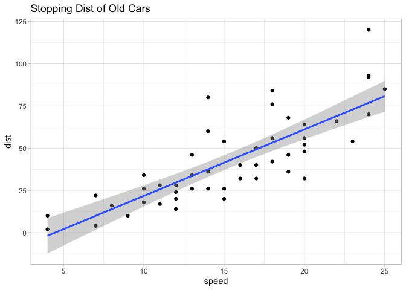
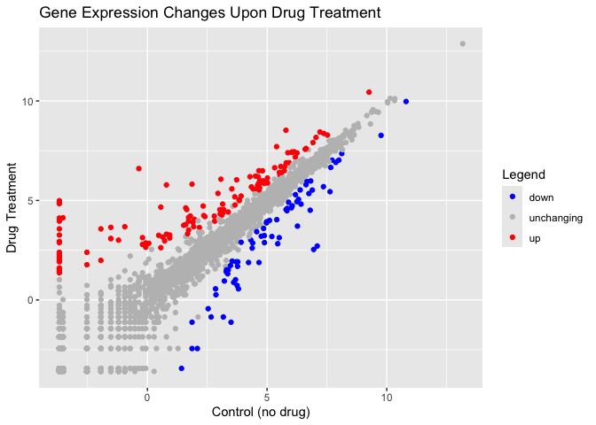
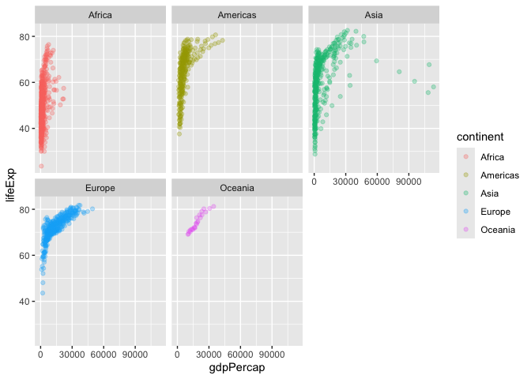
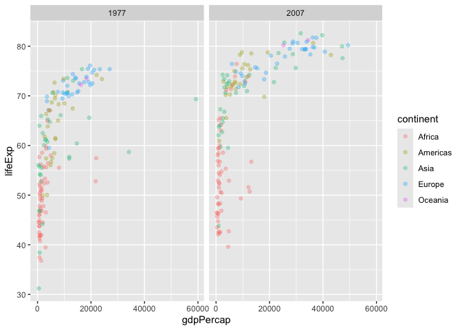
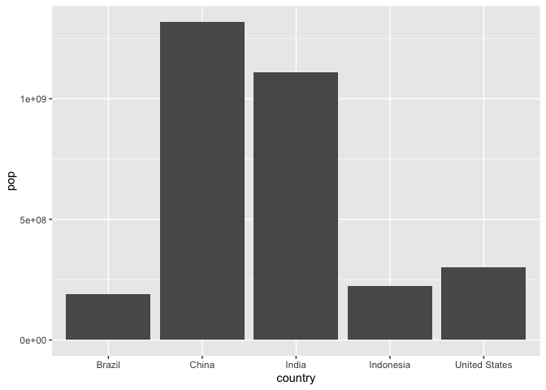
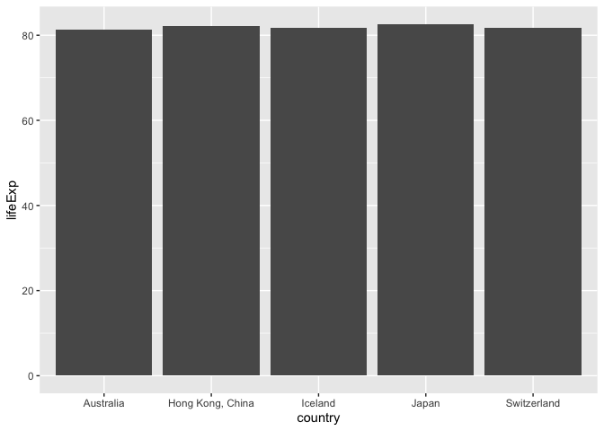

# class05_dataVisGgplot2
Derek Zhang (PID: A17819201)

- [Background](#background)
- [Add some custom features](#add-some-custom-features)
- [Gene expression figure](#gene-expression-figure)
- [Going further](#going-further)
- [Optional: Bar Charts!!](#optional-bar-charts)

## Background

there are many graphics systems in R for making plots These include
so-called “base” R graphics like the `plot()` function and add on
packages like ggplot2.

We can use the in-built `cars` dataset:

``` r
head(cars)
```

      speed dist
    1     4    2
    2     4   10
    3     7    4
    4     7   22
    5     8   16
    6     9   10

``` r
plot(cars)
```


The main function in **ggplot2** packet is the ggplot, and we before we
run it we must install ggplot2 by running ‘install.packages(“ggplot2”)’
in the console

> **N.B.** We never run `install.packages()` in our quarto doc because
> that would run it each time we render and become problematic

Once installed we need to load up the package into our R session

``` r
#install.packages("ggplot2")
library(ggplot2)
ggplot(cars)
```


Every ggplot has at least 3 layers: - The **data** (a data.frame of the
stuff we want to plot) - The **aesthetics** (how the data maps to the
plot) - The **geom** layer (how you want the plot drawn, e.g. points,
lines, etc.)

``` r
ggplot(cars) +
  aes(x=speed, y=dist) +
  geom_point()
```


## Add some custom features

Lets add a trend line that shows the relationship between speed and
distance.

``` r
ggplot(cars) +
  aes(x=speed, y=dist) +
  geom_point() + 
  geom_smooth(method = "lm") +
  theme_light() +
  labs(title="Stopping Dist of Old Cars")
```

    `geom_smooth()` using formula = 'y ~ x'



## Gene expression figure

``` r
url <- "https://bioboot.github.io/bimm143_S20/class-material/up_down_expression.txt"
genes <- read.delim(url)
head(genes)
```

            Gene Condition1 Condition2      State
    1      A4GNT -3.6808610 -3.4401355 unchanging
    2       AAAS  4.5479580  4.3864126 unchanging
    3      AASDH  3.7190695  3.4787276 unchanging
    4       AATF  5.0784720  5.0151916 unchanging
    5       AATK  0.4711421  0.5598642 unchanging
    6 AB015752.4 -3.6808610 -3.5921390 unchanging

``` r
sum(genes$State == "up")
```

    [1] 127

``` r
genes[genes$State=="up",]
```

                  Gene  Condition1 Condition2 State
    10           ABCC3  0.93057376   3.260304    up
    11           ABCC5  4.60042520   5.499443    up
    420          AHNAK  6.62848950   7.611752    up
    421         AHNAK2  3.65105100   5.181916    up
    496         ALPPL2  0.55860496   2.625953    up
    500         AMIGO2  3.14356730   4.817252    up
    503         AMOTL2  5.31663230   6.642013    up
    525          ANXA2  7.52371000   8.284804    up
    713          BCAS1 -3.68086100   1.604258    up
    733           BMP7 -3.68086100   2.392754    up
    736            BOC  5.79981700   6.891901    up
    949         CACNG4 -0.06942624   2.863645    up
    970           CAPS  3.18538760   4.542858    up
    1050          CDH6  5.39595460   7.703885    up
    1057          CDK6  5.73323700   6.704522    up
    1062          CDON  4.42533870   5.571092    up
    1067       CEACAM5 -3.68086100   3.571091    up
    1068       CEACAM6 -3.68086100   4.114453    up
    1134           CLU  2.79307000   4.210916    up
    1151        COL1A1  4.87202170   5.865926    up
    1158        COL9A3  0.93057376   3.114453    up
    1168         COTL1  5.51280100   6.403785    up
    1183        CRABP2  1.71906960   4.144826    up
    1186         CRIM1  4.51553630   6.223422    up
    1274 CTD-2033D15.1  0.05610465   2.845267    up
    1333          CTGF  1.71906960   3.960744    up
    1356        CYP1B1  4.62088900   5.582232    up
    1358       CYP26B1  2.40187930   4.189221    up
    1364         CYR61  4.65601730   6.492079    up
    1461         DSCAM -3.68086100   1.559864    up
    1462     DSCAM-AS1 -3.68086100   4.872747    up
    1492        EEF1A2  0.55860496   4.663152    up
    1523          EMP1  6.03529170   7.417067    up
    1536         EPHA5  3.91408560   5.221642    up
    1546         ERBB4  3.14356730   4.367219    up
    1659         FBLN1  4.80653240   6.489123    up
    1661          FBN2  9.25945200  10.440404    up
    1691          FHL2  2.17158170   3.636680    up
    1705          FMN1  4.63101340   6.185574    up
    1712         FOSL2  2.81099200   3.960744    up
    1731         FXYD3  1.96299520   4.051717    up
    1754         GATA3 -3.68086100   4.986129    up
    1772         GFRA1  1.64106700   4.542858    up
    1788         GLRA3 -3.68086100   1.466755    up
    1819          GPC1  5.71906950   6.492079    up
    1821        GPCPD1  4.64606760   5.854485    up
    1822          GPER -1.94389530   1.986129    up
    1834        GPR176  4.34150700   5.681397    up
    1869        GXYLT2  3.02573100   4.537144    up
    1875         H2AFJ -3.68086100   1.986129    up
    1922     HIST1H2BK  0.79307020   3.301331    up
    1925      HIST2H4A -1.52885800   3.083426    up
    1926      HIST2H4B -1.52885800   3.083426    up
    1936         HMGA2  5.92235330   6.894138    up
    1968         HSPG2  6.59138000   7.571790    up
    1981          IER3 -1.20692980   3.002808    up
    1996        IGFBP5  6.12756730   7.447085    up
    1997        IGFBP7  4.84183000   5.984030    up
    2086         KCNE4 -3.68086100   1.367219    up
    2111      KIAA1324 -3.52885800   4.129720    up
    2124        KIRREL  6.17850160   7.178250    up
    2154          KRT5 -0.06942624   2.647327    up
    2171          KYNU -3.68086100   3.260304    up
    2172         L1CAM  0.47114208   3.246365    up
    2251          LIPG  2.35378530   4.239345    up
    2253          LIX1  1.51553620   3.749689    up
    2331        MALAT1  6.03147500   7.431769    up
    2332         MALT1  7.36520200   8.369632    up
    2391        MFSD2A  1.93057370   3.678805    up
    2457         MSRB3  5.01417400   6.127821    up
    2471      MTRNR2L8  4.28492300   6.191041    up
    2472      MTRNR2L9  3.52642440   5.579455    up
    2475          MUC1  3.10049870   4.253351    up
    2480         MUC5B -1.94389530   3.571091    up
    2485           MYC  3.15764280   4.386413    up
    2492          MYL9  5.56917430   6.705796    up
    2537         NEAT1  1.79307010   4.218076    up
    2605          NRP1 -2.52885800   1.769318    up
    2618           NTS  1.86345960   5.817252    up
    2635          OAS3 -3.68086100   1.417845    up
    2684        OR52E8 -3.68086100   2.934904    up
    2783         PDGFC  5.53723100   6.265497    up
    2796         PEAK1  5.01803640   5.879537    up
    2809           PGR  1.60042510   4.625953    up
    2820        PIEZO1  4.69031050   5.998656    up
    2859          PLK2  7.04384230   8.167194    up
    2868         PMP22  3.83746430   4.994492    up
    2924      PRICKLE1  3.04099750   4.328049    up
    3039       RASGRP1  1.89740680   3.899714    up
    3069          RERG -3.68086100   2.083426    up
    3109        RN7SL1  6.91822500   7.909146    up
    3115          RND3  3.83746430   5.035598    up
    3123       RNF144B  6.24921940   7.385618    up
    3575 RP11-366L20.2 -0.20692979   2.788683    up
    3990 RP11-738E22.2  4.70476200   5.863645    up
    4034   RP11-79P5.2  0.64106710   3.159777    up
    4292  RP5-977B1.11  4.60042520   5.749689    up
    4325       RPS6KB1  5.59784650   6.399068    up
    4339       S100A14 -0.94389530   3.678805    up
    4340       S100A16  3.66096690   4.774183    up
    4344         S100P -3.68086100   1.917416    up
    4389        SEMA3C  2.94687560   5.354280    up
    4401      SERPINA3 -3.68086100   2.881792    up
    4410         SETD7  4.67081450   5.531408    up
    4430        SHISA3  0.71906954   2.969255    up
    4483       SLC39A6  7.20838930   8.439064    up
    4490       SLC6A14 -3.68086100   3.960744    up
    4500        SLC7A2  3.07105500   6.067658    up
    4544          SOX2 -3.68086100   2.260304    up
    4557         SPDEF -3.68086100   2.144827    up
    4578        SPTSSB -0.35893290   6.600154    up
    4593       STARD10  3.37803270   4.417845    up
    4624         SULF1 -2.52885800   2.392754    up
    4625         SULF2  0.79307020   5.781451    up
    4650         SYTL2  2.32912300   4.719736    up
    4663         TAGLN  3.72853000   6.035598    up
    4677        TBC1D9  4.68546100   5.639349    up
    4719          TFF1 -3.68086100   4.840635    up
    4732         THBS1  5.78629160   8.526009    up
    4742         TIMP3 -1.52885800   3.647327    up
    4801         TNNC1  1.60042510   3.788683    up
    4880        TSPYL5 -3.68086100   2.314752    up
    4960          VCAN  5.86774700   7.396703    up
    4961      VCAN-AS1  1.68059550   3.328049    up
    5027          XIST  1.71906960   3.514060    up
    5092          ZIK1 -0.20692979   3.129720    up
    5136        ZNF460  3.08585200   4.354280    up

A useful new function in this context is the `table()` function:

``` r
table(genes$State)
```


          down unchanging         up 
            72       4997        127 

``` r
ggplot(genes) +
  aes(x=Condition1, y=Condition2, color = State) +
  labs(title = "Gene Expression Changes Upon Drug Treatment", x = "Control (no drug)", y = "Drug Treatment", color = "Legend") +
  scale_colour_manual( values=c("blue","gray","red") ) +
  geom_point()
```



## Going further

Here we read the famous gapmider dataset

``` r
# File location online
url <- "https://raw.githubusercontent.com/jennybc/gapminder/master/inst/extdata/gapminder.tsv"

gapminder <- read.delim(url)
head(gapminder)
```

          country continent year lifeExp      pop gdpPercap
    1 Afghanistan      Asia 1952  28.801  8425333  779.4453
    2 Afghanistan      Asia 1957  30.332  9240934  820.8530
    3 Afghanistan      Asia 1962  31.997 10267083  853.1007
    4 Afghanistan      Asia 1967  34.020 11537966  836.1971
    5 Afghanistan      Asia 1972  36.088 13079460  739.9811
    6 Afghanistan      Asia 1977  38.438 14880372  786.1134

> Q. How many entries (i.e. rows) are there in this dataset?

``` r
nrow(gapminder)
```

    [1] 1704

> Q. How many countries are in this dataset

``` r
length(table(gapminder$country))
```

    [1] 142

``` r
length(unique(gapminder$country))
```

    [1] 142

Let’s make our first plot of the dataset:

``` r
p <- ggplot(gapminder) +
  aes(x = gdpPercap, y = lifeExp) +
  geom_point(aes(color=continent), alpha = 0.3)
```

``` r
p
```


``` r
p + facet_wrap(~continent)
```



Now we will make a plot for years 1977 and 2007

``` r
library(dplyr)
```


    Attaching package: 'dplyr'

    The following objects are masked from 'package:stats':

        filter, lag

    The following objects are masked from 'package:base':

        intersect, setdiff, setequal, union

``` r
gapminder_1977_2007 <- gapminder %>% filter (year == 2007 | year == 1977)
ggplot(gapminder_1977_2007) +
  aes(x = gdpPercap, y = lifeExp) +
  geom_point(aes(color=continent), alpha = 0.3) +
  facet_wrap(~year)
```



> Q. Make a histogram of lifeExp faceted by continent and colored by
> continent

Faceted by continent:

``` r
ggplot(gapminder) +
  aes(lifeExp) +
  geom_histogram() +
  facet_wrap(~continent)
```

    `stat_bin()` using `bins = 30`. Pick better value `binwidth`.


Coloured by continent:

``` r
ggplot(gapminder) +
  aes(lifeExp) +
  geom_histogram(aes(fill=continent))
```

    `stat_bin()` using `bins = 30`. Pick better value `binwidth`.


## Optional: Bar Charts!!

Organizing gapminder into the top 5 values of population in descending
order in the year 2007

``` r
gapminder_top5 <- gapminder %>% 
  filter(year==2007) %>% 
  arrange(desc(pop)) %>% 
  top_n(5, pop)

gapminder_top5
```

            country continent year lifeExp        pop gdpPercap
    1         China      Asia 2007  72.961 1318683096  4959.115
    2         India      Asia 2007  64.698 1110396331  2452.210
    3 United States  Americas 2007  78.242  301139947 42951.653
    4     Indonesia      Asia 2007  70.650  223547000  3540.652
    5        Brazil  Americas 2007  72.390  190010647  9065.801

Creating the bar chart:

``` r
ggplot(gapminder_top5) + 
  geom_col(aes(x = country, y = pop))
```



> Q. How do you do this for life expectancy?

``` r
gapminder_top5_lifeExp<- gapminder %>% 
  filter(year==2007) %>% 
  arrange(desc(lifeExp)) %>% 
  top_n(5, lifeExp)

gapminder_top5_lifeExp
```

               country continent year lifeExp       pop gdpPercap
    1            Japan      Asia 2007  82.603 127467972  31656.07
    2 Hong Kong, China      Asia 2007  82.208   6980412  39724.98
    3          Iceland    Europe 2007  81.757    301931  36180.79
    4      Switzerland    Europe 2007  81.701   7554661  37506.42
    5        Australia   Oceania 2007  81.235  20434176  34435.37

``` r
ggplot(gapminder_top5_lifeExp) + 
  geom_col(aes(x = country, y = lifeExp))
```


